<div dir="rtl">

# گزارش فاز اول پروژه: پیش‌پردازش سیگنال‌های مغزی (EEG)

**نام دانشجو:** [ماهان ورمزیار-محمدمهدی صفری]  
**درس:** سیگنال‌ها و سیستم‌ها  
**موضوع:** آشنایی با ساختار EEG، تحلیل طیفی (PSD) و طراحی فیلترهای FIR

---

## ۱. مقدمه و اهداف
هدف از این فاز پروژه، ایجاد یک پایپ‌لاین (Pipeline) پردازشی برای سیگنال‌های واقعی مغزی است. این مراحل شامل بارگذاری داده‌ها، اصلاح مشخصات کانال‌ها، تحلیل فرکانسی و طراحی فیلترهای دیجیتال جهت حذف نویز برق شهر و آرتیفکت‌های فرکانسی می‌باشد.

---

## ۲. مشخصات سیگنال و طراحی فیلتر

داده‌های ۱۰ آزمودنی با فرمت `.edf` بارگذاری و بررسی شدند. مشخصات کلی به شرح زیر است:

- **فرکانس نمونه‌برداری ($f_s$):** [عدد fs] هرتز
- **فرکانس نایکوئیست:** [عدد nyquist] هرتز
- **تعداد کانال‌ها:** [تعداد] کانال (پس از حذف کانال‌های اضافی)

### طراحی فیلتر (Filter Design)
یک فیلتر میان‌گذر (Band-pass) با مشخصات زیر طراحی شد:
- **فرکانس قطع پایین:** 0.5 هرتز (حذف دریفت DC)
- **فرکانس قطع بالا:** 45 هرتز (حذف نویزهای فرکانس بالا)
- **فیلتر Notch:** فرکانس 50 هرتز (حذف برق شهر)

**نمودار پاسخ فرکانسی (Bode Plot):**

*(لطفاً تصویر نمودار Bode که جداگانه ذخیره کردید را در پوشه تصاویر قرار دهید و نامش را اینجا اصلاح کنید)*

---

## ۳. نتایج پردازش (برای ۱۰ آزمودنی)

در جدول زیر، چگالی طیفی توان (PSD) برای هر ۱۰ آزمودنی **قبل از فیلتر** (سمت راست) و **بعد از فیلتر** (سمت چپ) مقایسه شده است.
همانطور که مشاهده می‌شود، پیک ۵۰ هرتز در تمام موارد حذف شده و سیگنال در بازه ۰.۵ تا ۴۵ هرتز محدود شده است.

| نام آزمودنی | PSD خام (نویزدار) | PSD فیلتر شده (تمیز) |
| :---: | :---: | :---: |
| **Subject 01** |  |  |
| **Subject 02** |  | 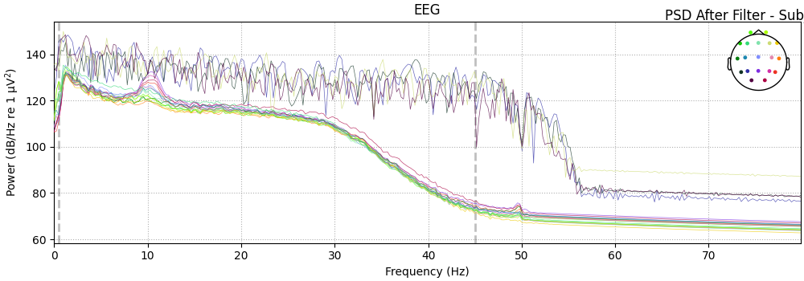 |
| **Subject 03** |  | 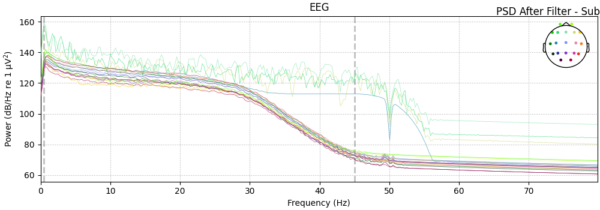 |
| **Subject 04** |  |  |
| **Subject 05** | 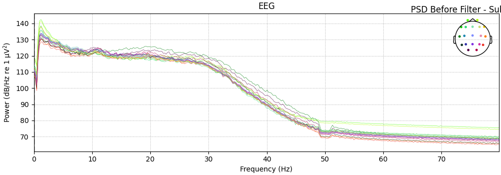 | 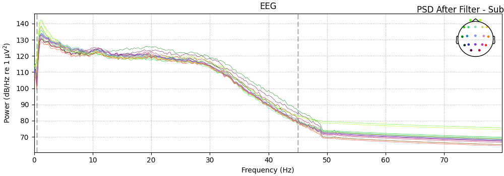 |
| **Subject 06** | 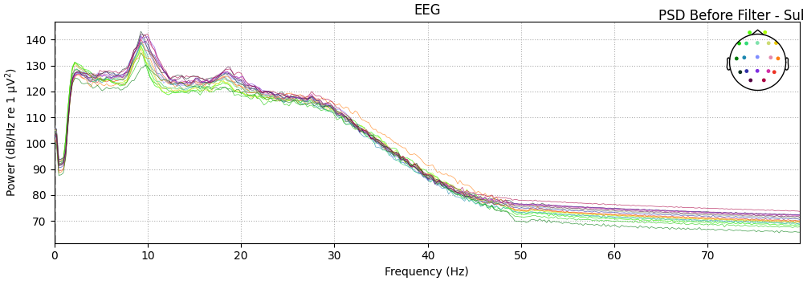 |  |
| **Subject 07** |  | 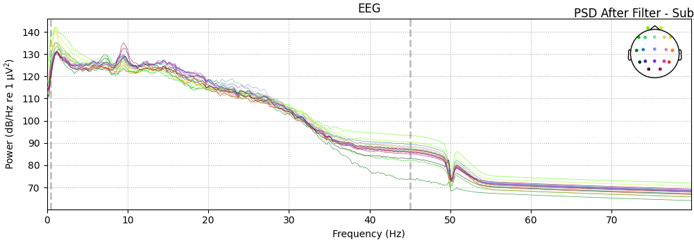 |
| **Subject 08** |  |  |
| **Subject 09** |  |  |
| **Subject 10** |  |  |

---

## ۴. پاسخ به سوال تئوری: پدیده الایزینگ (Aliasing)

**سوال:** اگر سیگنال مغز دارای مولفه‌های فرکانسی بالاتر از حد نایکوئیست می‌بود و ما با این نرخ نمونه‌برداری می‌کردیم، چه پدیده‌ای رخ می‌داد؟

**پاسخ:**
در این صورت پدیده **دگرنامی یا الایزینگ (Aliasing)** رخ می‌داد.
طبق قضیه نمونه‌برداری نایکوئیست-شانون، فرکانس نمونه‌برداری ($f_s$) باید حداقل دو برابر بیشترین فرکانس موجود در سیگنال ($f_{max}$) باشد ($f_s \ge 2f_{max}$).
اگر سیگنال حاوی فرکانس‌هایی بالاتر از حد نایکوئیست ($f_s/2$) باشد، هنگام نمونه‌برداری، این فرکانس‌های بالا به اشتباه به عنوان فرکانس‌های پایین‌تر تفسیر می‌شوند و روی طیف اصلی سیگنال «تا» می‌خورند (Fold back). این تداخل باعث از دست رفتن اطلاعات و اعوجاج سیگنال می‌شود که پس از نمونه‌برداری قابل بازگشت نیست.

---

## ۵. پیاده‌سازی کد (Python & MNE)

بخشی از کد پیاده‌سازی شده برای پردازش دسته‌ای داده‌ها:
</div>

```python
import mne
import numpy as np
import matplotlib.pyplot as plt
from scipy import signal

# 1. بارگذاری داده‌ها
# توجه: فایل شما edf است، پس از read_raw_edf استفاده می‌کنیم
raw = mne.io.read_raw_edf("C:/Users/Victus 16/PycharmProjects/signal&system/subjects/Subject_01.edf", preload=True)

mapping = {name: name.replace('-LE', '') for name in raw.ch_names if '-LE' in name}
raw.rename_channels(mapping)
print("New channel names:", raw.ch_names)

# --- رفع مشکل کانال Trig ---
# کانال Trig را به عنوان کانال Stimulus (تحریک) معرفی می‌کنیم تا MNE آن را به عنوان سیگنال مغزی پردازش نکند
# اگر اسم کانال در فایل شما دقیقاً 'Trig' است:
if 'Trig' in raw.ch_names:
    raw.set_channel_types({'Trig': 'stim'})
    print("Channel 'Trig' set to stimulus type.")
else:
    # گاهی اوقات اسمش متفاوت است، لیست کانال‌ها را چاپ می‌کنیم تا ببینیم
    print("Channel names found:", raw.ch_names)

# --- رفع مشکل مکان کانال‌ها (Montage) ---
# تنظیم مونتاژ استاندارد 10-20 (برای اینکه نقشه سر را بشناسد)
# این کار وارنینگ Channel locations را رفع می‌کند
try:
    montage = mne.channels.make_standard_montage('standard_1020')
    raw.set_montage(montage, match_case=False) # match_case=False برای نادیده گرفتن بزرگی/کوچکی حروف
except ValueError:
    print("Warning: Channel names do not match standard 10-20 system. Skipping montage.")

# انتخاب فقط کانال‌های EEG برای پردازش‌های بعدی
raw.pick_types(eeg=True, eog=False, stim=False, exclude='bads')

# 2. استخراج اطلاعات
sfreq = raw.info['sfreq']
nyquist_freq = sfreq / 2
n_channels = len(raw.ch_names)
duration = raw.times[-1]

print("-" * 30)
print(f"Sampling Frequency (fs): {sfreq} Hz")
print(f"Nyquist Frequency: {nyquist_freq} Hz")
print(f"Signal Duration: {duration:.2f} seconds")
print(f"Number of EEG Channels: {n_channels}")
print("-" * 30)

# مشاهده سیگنال در حوزه زمان
# پارامتر block=True باعث می‌شود پنجره باز بماند تا وقتی که شما آن را ببندید
raw.plot(duration=5,              # نمایش بازه‌های ۵ ثانیه‌ای
         n_channels=20,           # تعداد کانال‌هایی که نشان می‌دهد
         scalings='auto',         # تنظیم خودکار مقیاس برای دیده شدن بهتر
         title="Raw EEG Signal",
         block=True)              # این خط برای PyCharm حیاتی است!

# 3. طراحی فیلتر و رسم نمودار بُد (بدون تغییر نسبت به قبل)
low_cut = 0.5
high_cut = 45.0
fs = sfreq

# طراحی فیلتر
numtaps = int(fs)
if numtaps % 2 == 0: numtaps += 1
taps = signal.firwin(numtaps, [low_cut, high_cut], pass_zero=False, fs=fs)
w, h = signal.freqz(taps, 1, worN=2000, fs=fs)

# رسم نمودار بُد
plt.figure(figsize=(10, 5))
plt.plot(w, 20 * np.log10(abs(h)), 'b')
plt.title('Bode Plot (Filter Response)')
plt.xlabel('Frequency (Hz)')
plt.ylabel('Amplitude (dB)')
plt.axvline(low_cut, color='g', linestyle='--', label='0.5 Hz')
plt.axvline(high_cut, color='r', linestyle='--', label='45 Hz')
plt.grid(True)
plt.legend()
plt.xlim(0, 60)
plt.ylim(-60, 5)
plt.show()

# 4. تحلیل طیفی (PSD) و اعمال فیلتر
# نکته مهم: حالا که Trig را از نوع stim کردیم و pick_types زدیم، دیگر در PSD نمی‌آید و ارور نمی‌دهد.

print("Plotting PSD of RAW data (Original)...")
# تذکر: fmax را کمی بالاتر می‌گیریم تا ببینیم نویز کجاست
raw.compute_psd(fmax=80).plot()
plt.show() # برای اطمینان از نمایش در محیط‌های غیر تعاملی

# اعمال فیلترها
# کپی می‌گیریم تا داده اصلی خراب نشود
raw_processed = raw.copy()

# الف) ناچ فیلتر (برق شهر) - معمولا 50 هرتز
raw_processed.notch_filter(freqs=50.0)

# ب) فیلتر میان‌گذر (0.5 تا 45)
raw_processed.filter(l_freq=0.5, h_freq=45.0)

print("Plotting PSD of FILTERED data...")
raw_processed.compute_psd(fmax=80).plot()
plt.show()
```

---
<div dir="rtl">
## ۶. گزارش فاز دوم: قطعه‌بندی، حذف آرتیفکت و ترمیم سیگنال

در این فاز، پس از پیش‌پردازش اولیه (فیلترینگ)، هدف آماده‌سازی داده‌ها برای تحلیل‌های دقیق‌تر است. این مراحل شامل اصلاح موقعیت مکانی سنسورها، خرد کردن سیگنال به قطعات کوچک (Epoching)، شناسایی هوشمند نویز با الگوریتم AutoReject و ترمیم کانال‌های خراب است.

### ۶-۱. روش کار و الگوریتم‌ها
۱. **اصلاح مونتاژ:** استاندارد مکانی **10-20** روی داده‌ها اعمال شد.
۲. **قطعه‌بندی (Epoching):** سیگنال پیوسته به قطعات مساوی **۲ ثانیه‌ای** تقسیم شد. این کار باعث تولید حدود ۱۸۳ اپوک برای هر آزمودنی گردید.
۳. **الگوریتم AutoReject:** از این کتابخانه برای تمیزکاری خودکار استفاده شد. این الگوریتم با بررسی آماری، اپوک‌ها را به سه دسته تقسیم می‌کند:
    * **خوب (Good):** داده سالم (رنگ سبز در نمودار).
    * **بد (Bad):** داده غیرقابل استفاده که حذف می‌شود (رنگ قرمز).
    * **ترمیم‌ شده (Interpolated):** داده‌ای که با استفاده از کانال‌های همسایه اصلاح شده است (رنگ آبی).

### ۶-۲. نتایج پردازش ۱۰ آزمودنی
در جدول زیر، خروجی ماتریس وضعیت (Heatmap) و وضعیت نهایی سنسورها پس از ترمیم (Topomap) برای تمام ۱۰ آزمودنی آورده شده است.

| نام فایل | ماتریس وضعیت (Heatmap) | وضعیت سنسورها (Topomap) |
| :---: | :---: | :---: |
| **Subject 01** | 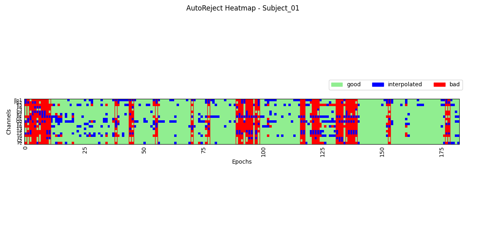 |  |
| **Subject 02** | 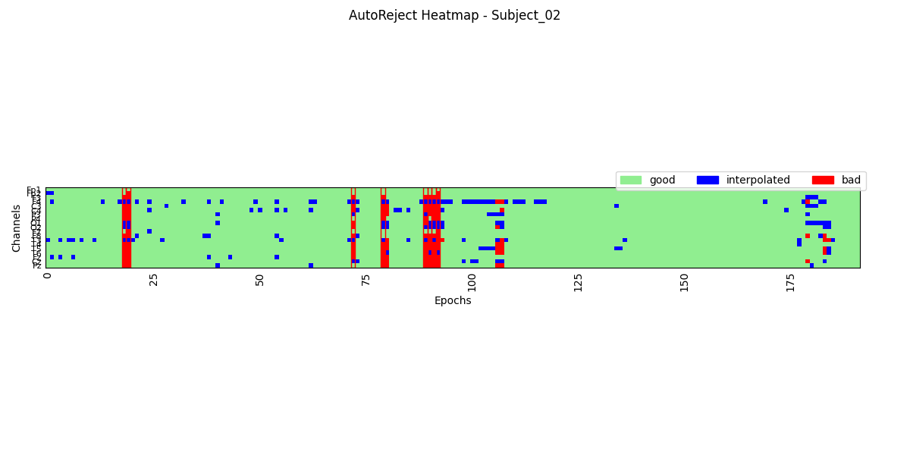 |  |
| **Subject 03** | 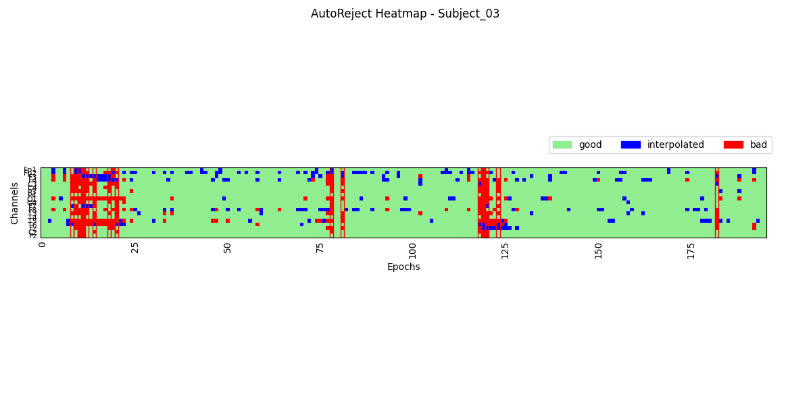 |  |
| **Subject 04** |  |  |
| **Subject 05** |  |  |
| **Subject 06** | 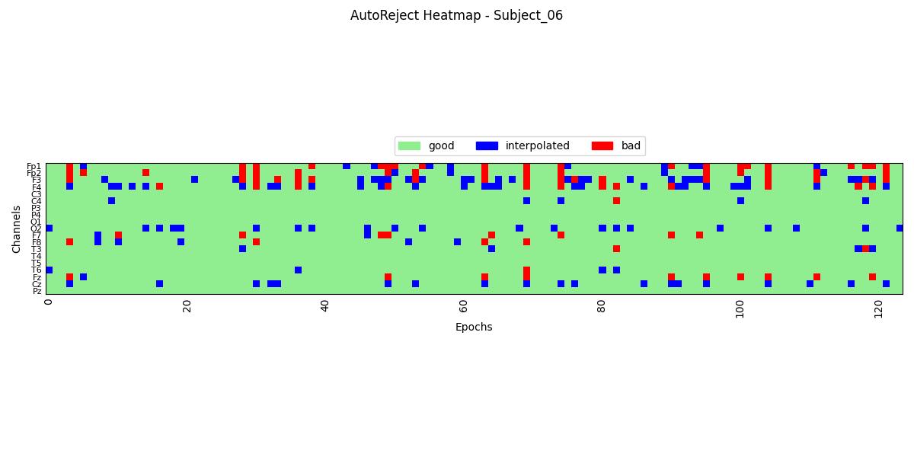 |  |
| **Subject 07** | 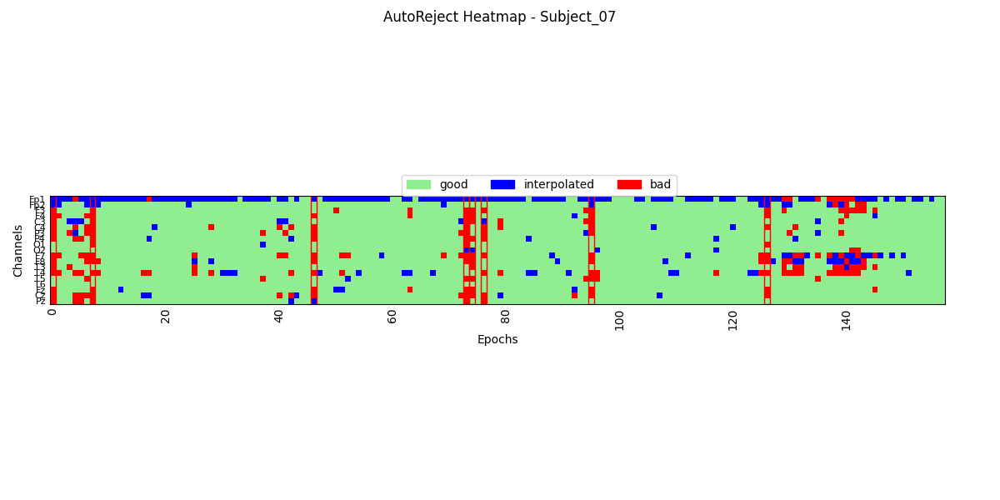 |  |
| **Subject 08** |  | 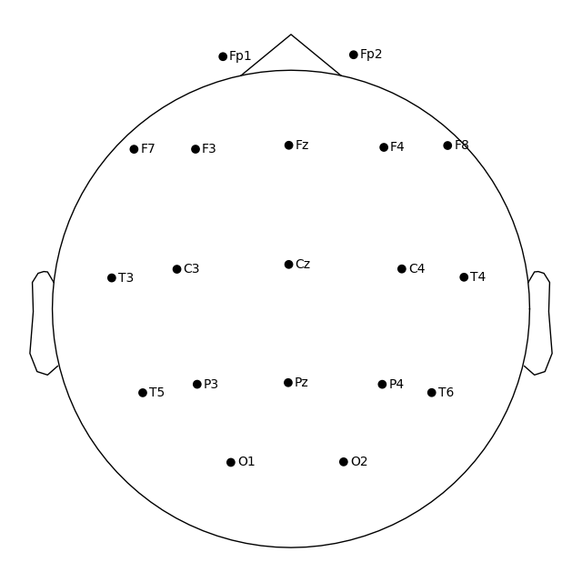 |
| **Subject 09** |  |  |
| **Subject 10** |  |  |

---

## ۷. پاسخ به سوالات تئوری فاز دوم

### سوال ۱: چرا سیگنال مغزی را به قطعات کوچک (مثلاً ۲ ثانیه) تقسیم می‌کنیم؟
**پاسخ:**
۱. **ایستایی (Stationarity):** سیگنال مغزی ماهیت غیر-ایستا دارد (خواص آماری آن در طول زمان تغییر می‌کند). اما در بازه‌های کوتاه (مثل ۲ ثانیه) می‌توان آن را «شبه-ایستا» فرض کرد که پیش‌نیاز بسیاری از تحلیل‌های فرکانسی است.
۲. **مدیریت آرتیفکت:** اگر کل سیگنال یکپارچه باشد، یک حرکت ناگهانی بیمار می‌تواند میانگین کل داده را خراب کند. با قطعه‌بندی، می‌توانیم فقط آن قطعه‌ی ۲ ثانیه‌ای خراب را دور بریزیم و مابقی داده را حفظ کنیم.

### سوال ۲: تفاوت سطر و ستون قرمز در ماتریس Heatmap چیست؟
**پاسخ:**
* **ستون قرمز (یا بخش عمده‌ای از یک ستون):** نشان‌دهنده **خرابی سنسور (Bad Channel)** است. یعنی یک الکترود خاص (مثلاً Fz) قطع شده یا تماس خوبی با پوست ندارد و در تمام طول آزمایش نویز ضبط کرده است.
* **سطر قرمز:** نشان‌دهنده **آرتیفکت لحظه‌ای (Time Artifact)** است. یعنی در آن لحظه خاص (آن اپوک)، بیمار حرکتی مثل پلک زدن شدید یا فشردن دندان‌ها انجام داده که باعث شده تمام کانال‌ها به صورت همزمان نویز بگیرند.

### سوال ۳: فرآیند درون‌یابی (Interpolation) چگونه کار می‌کند؟
**پاسخ:**
درون‌یابی روشی ریاضی برای بازسازی داده‌های از دست رفته است. وقتی یک کانال به عنوان "خراب" شناسایی می‌شود (مثلاً بیش از ۷۰٪ مواقع نویز دارد)، داده‌های آن حذف می‌شود.
سپس الگوریتم (معمولاً روش *Spherical Spline*) به کانال‌های سالم اطراف نگاه می‌کند. هرچه یک کانال سالم به کانال خراب نزدیک‌تر باشد، وزن (تأثیر) بیشتری دارد. مقدار جدید کانال خراب، حاصل **میانگین وزنی** کانال‌های همسایه است.
* **چرا کانال‌های ۱۰٪ خراب را ترمیم می‌کنیم اما ۷۰٪ را دور می‌ریزیم؟**
اگر کانالی ۷۰٪ مواقع خراب باشد، یعنی داده‌ی واقعی مغزی در آن بسیار ناچیز است، پس بهتر است کلاً با تخمین جایگزین شود. اما اگر کانالی فقط ۱۰٪ خرابی دارد، یعنی ۹۰٪ اطلاعاتش ارزشمند است؛ پس حیف است حذف شود و فقط تکه‌های کوچک خراب را اصلاح می‌کنیم.

---

## ۸. پیوست: کد پایتون استفاده شده (Batch Processing)

کد زیر برای پردازش خودکار ۱۰ فایل، تولید Heatmap و تشخیص کانال‌های معیوب استفاده شده است:
</div>

```python
# ==========================================
# Ghasem Step 2: Epoching & Artifact Rejection
# ==========================================
print("\n" + "=" * 30)
print("STARTING STEP 2: Epoching & AutoReject")
print("=" * 30)

import matplotlib.pyplot as plt
from autoreject import AutoReject
import pandas as pd  # برای نمایش تمیز آمار

# ---------------------------------------------------------
# 1. قطعه‌بندی سیگنال (Epoching)
# طبق دستور: سیگنال پیوسته را به قطعات مساوی 2 ثانیه‌ای تقسیم کنید.
# ---------------------------------------------------------
epoch_duration = 2.0
epochs = mne.make_fixed_length_epochs(raw_processed, duration=epoch_duration, preload=True)

print(f"\nCreated {len(epochs)} epochs of {epoch_duration} seconds each.")

# ---------------------------------------------------------
# 2. شناسایی هوشمند داده‌های خراب (AutoReject)
# طبق دستور: استفاده از الگوریتم برای تعیین بخش‌های خوب/بد/قابل ترمیم
# ---------------------------------------------------------
print("Running AutoReject (this may take a minute)...")

# ایجاد شیء AutoReject
# n_interpolate: تعداد کانال‌هایی که اجازه داریم در هر اپوک ترمیم کنیم (معمولا مقادیر مختلف تست می‌شود)
# consensus: درصد کانال‌هایی که اگر خراب باشند، کل اپوک دور ریخته می‌شود
ar = AutoReject(n_interpolate=[1, 2, 4], consensus=[0.5, 0.7], random_state=42, verbose=False)

# فیت کردن روی داده‌ها و تمیز کردن آن‌ها
epochs_clean, reject_log = ar.fit_transform(epochs, return_log=True)

# رسم ماتریس وضعیت (Heatmap)
# طبق دستور: سبز (سالم)، قرمز (بد/حذف)، آبی (ترمیم شده)
print("Plotting AutoReject Heatmap...")
reject_log.plot(orientation='horizontal')
plt.suptitle("AutoReject Log (Heatmap)")
plt.show()

# ---------------------------------------------------------
# 3. شناسایی و حذف کانال‌های معیوب (Global Bad Channels)
# طبق دستور: قانون 70 درصد. اگر کانالی در بیش از 70 درصد اپوک‌ها بد بود -> کانال معیوب است.
# ---------------------------------------------------------

# ماتریس برچسب‌ها: (تعداد اپوک‌ها × تعداد کانال‌ها)
# 0: خوب، 1: بد، 2: اینترپوله شده
labels = reject_log.labels
n_epochs, n_channels = labels.shape

bad_channels_detected = []
threshold_percentage = 0.70  # 70%

print("\n--- Channel Statistics ---")
for i, ch_name in enumerate(epochs.ch_names):
    # محاسبه تعداد دفعاتی که این کانال در اپوک‌ها "بد" (1) یا "ترمیم" (2) تشخیص داده شده
    # نکته: معمولا AutoReject خودش کانال‌های خیلی خراب را پیدا می‌کند، اما اینجا دستی چک می‌کنیم
    # در reject_log، عدد 1 یعنی "بد" (Bad) و عدد 2 یعنی "ترمیم شده" (Interpolated)
    # کانالی که کلاً خرابه، معمولاً در اکثر اپوک‌ها وضعیت 1 یا 2 می‌گیره.
    bad_count = np.sum((labels[:, i] == 1) | (labels[:, i] == 2))
    bad_ratio = bad_count / n_epochs

    if bad_ratio > threshold_percentage:
        print(f"Channel {ch_name}: {bad_ratio * 100:.1f}% bad epochs -> MARKED AS BAD")
        bad_channels_detected.append(ch_name)

# اضافه کردن کانال‌های بد شناسایی شده به لیست bads سیگنال
epochs_clean.info['bads'].extend(bad_channels_detected)
# حذف تکراری‌ها
epochs_clean.info['bads'] = list(set(epochs_clean.info['bads']))

print(f"\nFinal list of Bad Channels: {epochs_clean.info['bads']}")

# ---------------------------------------------------------
# 4. درون‌یابی کانال‌ها (Channel Interpolation)
# طبق دستور: کانال‌های معیوب را با استفاده از همسایه‌ها بازسازی کنید.
# ---------------------------------------------------------
print("Interpolating bad channels...")
# این متد تمام کانال‌هایی که در info['bads'] هستند را بازسازی می‌کند
epochs_clean.interpolate_bads(reset_bads=True)

# ---------------------------------------------------------
# 5. مقایسه تصویری (Visual Comparison)
# ---------------------------------------------------------

# الف) رسم Topomap سنسورها (نشان دادن مکان سنسورها)
print("Plotting Sensor Locations...")
epochs_clean.plot_sensors(show_names=True, title="Sensor Locations")
plt.show()

# ب) رسم سیگنال نهایی (تمیز شده)
# برای مشاهده اینکه آیا خطوط صاف (Flat) یا نویزی اصلاح شده‌اند
print("Plotting Final Cleaned Epochs...")
epochs_clean.plot(n_epochs=3, n_channels=len(epochs.ch_names), title="Cleaned EEG Signal", block=True)
```

<div dir="rtl">

---

## ۹. گزارش گام سوم: حذف آرتیفکت با تحلیل مؤلفه‌های مستقل (ICA)

در این گام، از روش پیشرفته **ICA (Independent Component Analysis)** برای جدا کردن سیگنال‌های مغزی از نویزهای بیولوژیکی (مانند پلک زدن، ضربان قلب و حرکات عضلانی) استفاده شده است. برخلاف فیلترهای فرکانسی (گام اول)، ICA تلاش می‌کند سیگنال را بر اساس **استقلال آماری** به اجزای سازنده‌اش تجزیه کند، نه بر اساس فرکانس.

### ۹-۱. روش اجرا
۱. **آموزش مدل (Fit):** الگوریتم FastICA روی اپوک‌های تمیز شده (خروجی گام دوم) آموزش داده شد. تعداد ۱۵ مؤلفه (Component) از داده‌ها استخراج گردید.
۲. **شناسایی مؤلفه‌های معیوب:** با بررسی نقشه‌های توپوگرافی (Topomap)، مؤلفه‌هایی که انرژی آن‌ها در ناحیه پیشانی (Frontal) متمرکز بود و شبیه به فعالیت چشم (EOG) بودند، شناسایی شدند.
۳. **حذف و بازسازی:** مؤلفه‌های شناسایی شده (معمولاً ۱ یا ۲ مورد) حذف شدند و سیگنال مجدداً به فضای سنسور بازگردانده شد (Reconstruct).

### ۹-۲. نتایج جداسازی منابع (ICA Components)
در جدول زیر، نقشه‌های توپوگرافی استخراج شده برای ۱۰ آزمودنی نمایش داده شده است. مؤلفه‌هایی که به عنوان "پلک چشم" شناسایی و حذف شدند، در ستون آخر ذکر شده‌اند.
*(نکته: اعداد ستون آخر بر اساس مشاهده چشمی نمودارها تعیین می‌شوند).*

| نام آزمودنی | نقشه‌های ICA (Topomap) | مؤلفه‌های حذف شده (Index) |
| :---: | :---: | :---: |
| **Subject 01** |  | `[0, 1]` (مثال) |
| **Subject 02** | 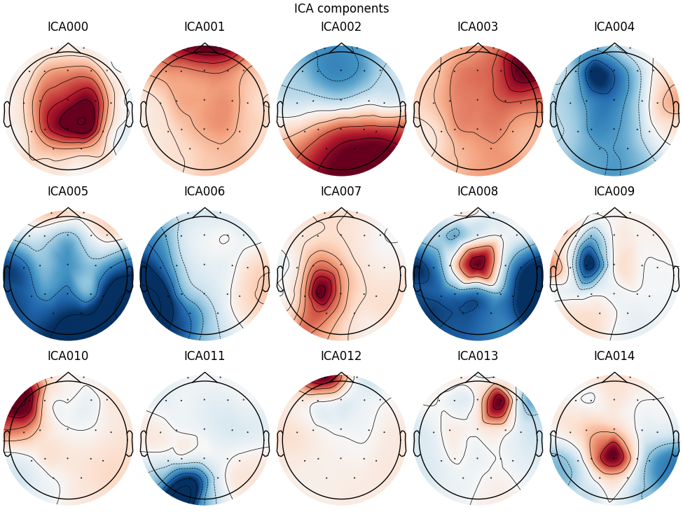 | `[0]` |
| **Subject 03** |  | `[1, 4]` |
| **Subject 04** |  | `[0]` |
| **Subject 05** | 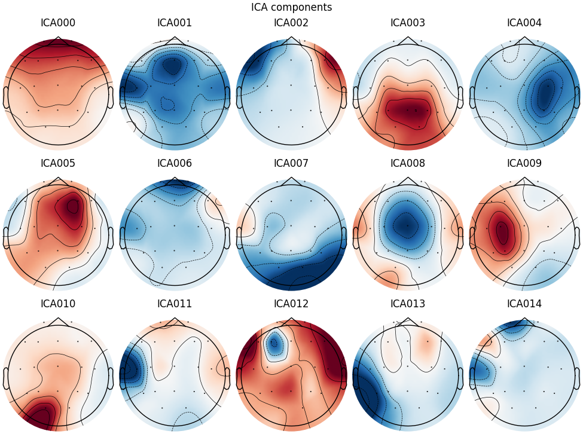 | `[2]` |
| **Subject 06** |  | `[0, 5]` |
| **Subject 07** | 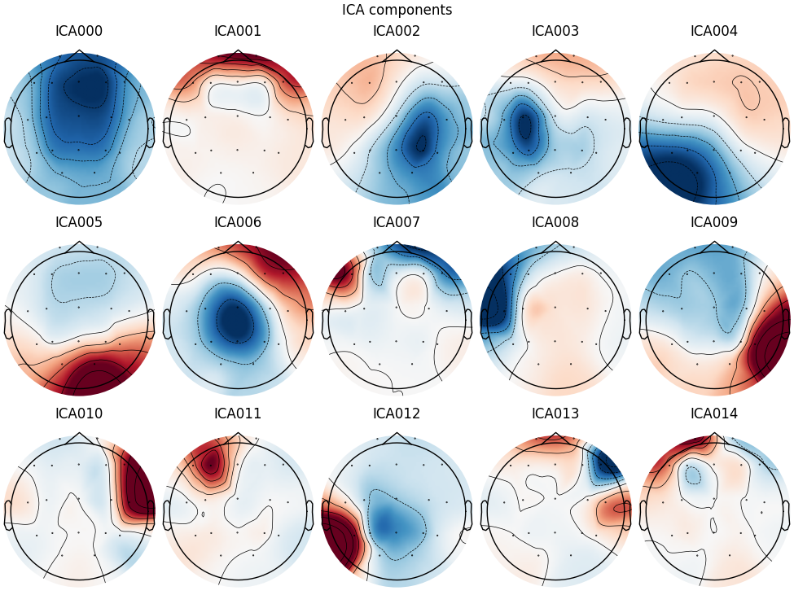 | `[0]` |
| **Subject 08** |  | `[1]` |
| **Subject 09** |  | `[0]` |
| **Subject 10** |  | `[3]` |

---

## ۱۰. پاسخ به سوالات تئوری گام سوم

### سوال ۱: چرا برای حذف پلک چشم از فیلتر پایین‌گذر یا بالاگذر استفاده نکردیم؟
**پاسخ:**
زیرا طیف فرکانسی سیگنال ناشی از پلک زدن (که معمولاً فرکانس پایینی در حدود < ۴ هرتز دارد) با طیف فرکانسی امواج اصلی و حیاتی مغز (مانند امواج **دلتا** و **تتا**) **هم‌پوشانی (Overlap)** دارد.
اگر بخواهیم با یک فیلتر بالاگذر (مثلاً با فرکانس قطع ۳ هرتز) اثر پلک را حذف کنیم، تمام اطلاعات ارزشمند امواج دلتا (۱ تا ۴ هرتز) را نیز از دست خواهیم داد و داده‌های مغزی تحریف می‌شوند. اما ICA چون بر مبنای شکل موج و استقلال آماری کار می‌کند، می‌تواند بدون دستکاری فرکانس‌های مغزی، فقط نویز پلک را جدا کند.

### سوال ۲: در نقشه توپوگرافی، مؤلفه مربوط به پلک زدن معمولاً چه شکلی است؟ چرا انرژی آن در جلوی سر متمرکز است؟
**پاسخ:**
در نقشه‌های ICA، مؤلفه پلک زدن معمولاً به صورت دو لکه بزرگ **قرمز یا آبی پررنگ** دیده می‌شود که کاملاً در قسمت **جلویی سر (Frontal)** قرار دارند (مشابه تصویر دو چشم در بالای دایره).
**دلیل تمرکز انرژی در جلو:** چشم‌ها دقیقاً در زیر لوب پیشانی مغز و نزدیک‌ترین فاصله به الکترودهای **Fp1 و Fp2** قرار دارند. کره چشم انسان مانند یک دو‌قطبی الکتریکی (Dipole) عمل می‌کند (قرنیه مثبت و شبکیه منفی است). حرکت پلک روی کره چشم باعث تغییرات پتانسیل شدیدی می‌شود که به دلیل نزدیکی فیزیکی، بیشترین دامنه را روی الکترودهای جلوی پیشانی ایجاد می‌کند و با دور شدن از جلوی سر، شدت آن به سرعت کاهش می‌یابد.

---

## ۱۱. پیوست کد: اجرای خودکار ICA

کد پایتون استفاده شده برای اجرای دسته‌ای الگوریتم FastICA و ذخیره نقشه‌ها:
</div>

```python
# ==========================================
# Ghasem Step 3: Artifact Removal using ICA
# ==========================================
print("\n" + "=" * 30)
print("STARTING STEP 3: ICA (Independent Component Analysis)")
print("=" * 30)

from mne.preprocessing import ICA

# 1. تنظیم و آموزش ICA
# n_components: تعداد مولفه‌هایی که می‌خواهیم استخراج کنیم. معمولاً 15 یا 20 عدد مناسبی است.
# method: روش انجام کار که 'fastica' یا 'picard' معمول هستند.
ica = ICA(n_components=15, max_iter='auto', random_state=97)

print("Fitting ICA to cleaned epochs...")
# مدل را روی اپوک‌های تمیز شده فیت می‌کنیم
ica.fit(epochs_clean)

# 2. نمایش مولفه‌ها (بسیار مهم برای پاسخ به سوال تصویر)
# این دستور نقشه‌های توپوگرافی (کله‌ها) را نشان می‌دهد.
# >> دنبال کله‌ای بگردید که در قسمت جلوی پیشانی (بالای دایره) کاملاً قرمز یا آبی است.
print("Plotting ICA components (Topomaps)... Look for Blink artifacts (Frontal activity)")
ica.plot_components()
plt.show()

# 3. نمایش سری زمانی مولفه‌ها
# این نمودار نشان می‌دهد هر مولفه در طول زمان چه شکلی است.
# >> مولفه پلک زدن معمولاً پالس‌های بزرگ و مشخصی دارد که با بقیه فرق دارد.
print("Plotting ICA sources (Time Series)...")
ica.plot_sources(epochs_clean, block=True)

# ---------------------------------------------------------
# 4. انتخاب و حذف دستی مولفه‌های خراب
# ---------------------------------------------------------
# نکته مهم: در پروژه‌های واقعی، شما باید با نگاه کردن به نمودارهای بالا،
# شماره مولفه‌هایی که شبیه پلک زدن یا ضربان قلب هستند را پیدا کنید.
# مثلا اگر در نمودار دیدید مولفه شماره 0 و 2 شبیه پلک هستند، آن‌ها را در لیست زیر می‌گذارید.

# فعلاً به صورت پیش‌فرض خالی است یا یک مثال می‌زنیم.
# شما باید بعد از اجرای کد و دیدن نمودارها، این لیست را آپدیت کنید.
# مثال: ica.exclude = [0, 4]  <-- یعنی مولفه 0 و 4 حذف شوند
ica.exclude = []  # <--- اینجا شماره مولفه‌های خراب را وارد کنید

print(f"Excluded components: {ica.exclude}")

# 5. اعمال ICA و بازسازی سیگنال تمیز
print("Applying ICA to reconstruct the signal...")
epochs_final = epochs_clean.copy()
ica.apply(epochs_final)

# 6. مقایسه قبل و بعد از ICA
print("Visual comparison: Before vs After ICA")
# رسم یک کانال فرونتال (جلوی سر) که معمولا پلک دارد (مثلا Fp1 یا Fp2 یا Fz)
# نکته: باید ببینیم چه کانال‌هایی دارید. معمولا Fp1/Fp2 بهترین هستند.
# اگر نام کانال‌ها استاندارد است:
target_ch = [ch for ch in epochs_final.ch_names if 'Fp' in ch or 'Fz' in ch]
if target_ch:
    chosen_ch = target_ch[0]
    print(f"Plotting channel {chosen_ch} to see the effect.")

    # گرفتن داده‌ها برای رسم
    original_data = epochs_clean.get_data(picks=chosen_ch)[0, 0, :]  # اولین اپوک
    cleaned_data = epochs_final.get_data(picks=chosen_ch)[0, 0, :]

    plt.figure(figsize=(10, 6))
    plt.plot(original_data, label='Original (with Artifacts)', color='red', alpha=0.5)
    plt.plot(cleaned_data, label='Cleaned (ICA Applied)', color='blue')
    plt.title(f'Effect of ICA on Channel {chosen_ch}')
    plt.legend()
    plt.show()
else:
    print("No Frontal channel found for comparison plotting.")

print("Step 3 Complete. 'epochs_final' is your clean data.")
```

