<style>
body {
    direction: rtl;
    text-align: justify; 
    font-family: "B Nazanin", "Lotus", "Vazirmatn", Tahoma, serif; /* اولویت با فونت‌های رسمی */
    line-height: 1.8; 
    font-size: 14pt; 
    margin: 0;
    padding: 40px;
    color: #250d0d;
    background-color: #ffffff; 
}

h1, h2, h3 {
    font-family: "B Titr", "Vazirmatn", sans-serif; 
    color: #403232;
    margin-top: 40px;
    margin-bottom: 20px;
}

h1 {
    font-size: 26px;
    text-align: center;
    border-bottom: 3px solid #484885;
    padding-bottom: 15px;
}

h2 {
    font-size: 22px;
    border-bottom: 1px solid #250d0d;
    padding-bottom: 10px;
}

h3 {
    font-size: 18px;
    font-weight: bold;
}

p {
    margin-bottom: 15px;
    text-indent: 30px; 
}

ul, ol {
    margin-right: 20px;
    margin-bottom: 20px;
}

li {
    margin-bottom: 8px;
}

pre {
    direction: ltr;
    text-align: left;
    background: #f4f6f7; 
    border: 1px solid #cfd8dc;
    border-left: 5px solid #2c3e50;
    padding: 15px;
    border-radius: 4px;
    font-family: "Consolas", "Courier New", monospace;
    font-size: 13px;
    line-height: 1.5;
    overflow-x: auto; 
    margin: 25px 0;
    box-shadow: 0 2px 4px rgba(0,0,0,0.05);
}

code {
    background-color: #fce4ec; 
    padding: 2px 5px;
    border-radius: 3px;
    font-family: "Consolas", monospace;
    font-size: 0.9em;
    color: #c7254e;
}

pre code {
    background-color: transparent; 
    padding: 0;
    color: #333;
}

table {
    width: 100%;
    border-collapse: collapse;
    margin: 30px 0;
    font-size: 14px;
    font-family: "B Nazanin", Tahoma;
}

th, td {
    border: 1px solid #bdc3c7;
    padding: 12px;
    text-align: center;
}

th {
    background-color: #ecf0f1; 
    color: #2c3e50;
    font-weight: bold;
}

tr:nth-child(even) {
    background-color: #f9f9f9; 
}

img {
    display: block;
    margin: 30px auto;
    max-width: 90%;
    border: 1px solid #ddd;
    padding: 5px;
    border-radius: 4px;
    box-shadow: 0 4px 8px rgba(0,0,0,0.1);
}

blockquote {
    border-right: 4px solid #3498db;
    background-color: #eef8ff;
    padding: 15px 20px;
    margin: 25px 0;
    color: #555;
    font-style: italic;
    border-radius: 4px;
}
</style>


# گزارش پروژه درس سیگنال‌ها و سیستم‌ها
## فاز اول: پیش‌پردازش و تحلیل طیفی سیگنال‌های EEG

---

### ۱. مقدمه و شرح مساله
سیگنال‌های مغزی (EEG) ثبت شده در محیط‌های واقعی همواره حاوی نویزهای محیطی (مانند برق شهر) و آرتیفکت‌های فیزیولوژیکی هستند. هدف از گام اول این پروژه، پیاده‌سازی یک پایپ‌لاین (Pipeline) پردازشی جهت بارگذاری داده‌های خام، اصلاح ساختار داده‌ها، تحلیل محتوای فرکانسی و طراحی فیلترهای مناسب جهت آماده‌سازی سیگنال برای مراحل بعدی است.

---

### ۲. مشخصات داده‌های ثبت شده
داده‌های خام مربوط به ۱۰ آزمودنی با فرمت استاندارد `.edf` بارگذاری گردید. پس از بررسی هدر (Header) فایل‌ها و حذف کانال‌های اضافی (مانند کانال‌های تحریک)، مشخصات اصلی سیگنال به شرح زیر استخراج شد:

| پارامتر |      مقدار       | توضیحات |
| :--- |:----------------:| :--- |
| **فرکانس نمونه‌برداری ($f_s$)** |   **500** هرتز   | نرخ ثبت داده‌ها در هر ثانیه  |
| **فرکانس نایکوئیست ($f_N$)** |   **250** هرتز   | حداکثر فرکانس قابل بازسازی بدون الایزینگ  |
| **طول ثبت** | **367.20** ثانیه | مدت زمان کل آزمایش برای هر آزمودنی  |
| **تعداد کانال‌ها** |   **19** کانال   | کانال‌های فعال EEG پس از حذف کانال‌های غیرمرتبط  |

---

### ۳. طراحی فیلتر و پاسخ فرکانسی
جهت استخراج باندهای فرکانسی مفید مغزی و حذف نویزها، فیلترهای زیر طراحی و اعمال شدند:

1.  **فیلتر میان‌گذر (Band-pass):** با فرکانس قطع پایین **0.5 هرتز** (جهت حذف دریفت‌های DC و نویزهای فرکانس بسیار پایین) و فرکانس قطع بالا **45 هرتز** (جهت حذف نویزهای فرکانس بالا).
2.  **فیلتر ناچ (Notch):** در فرکانس **50 هرتز** جهت حذف تداخل ناشی از برق شهر (Power-line hum).

**تحلیل پاسخ فرکانسی (Bode Plot):**
در نمودار زیر پاسخ فرکانسی فیلتر طراحی شده مشاهده می‌شود. همانطور که مشخص است، بهره (Gain) در بازه عبور (0.5 تا 45) برابر با صفرdB است و در فرکانس‌های قطع به شدت کاهش می‌یابد.

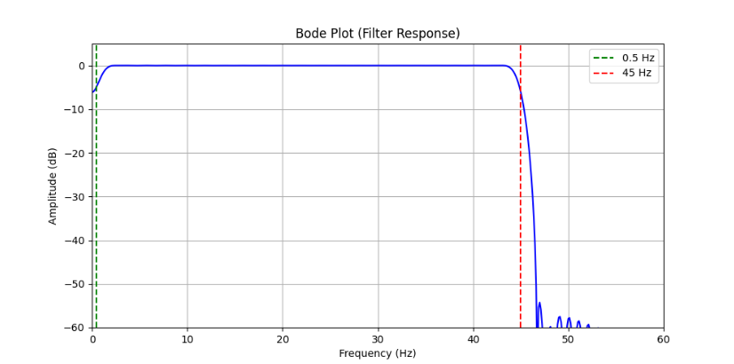
> نکته: برای تولید این نمودار از دستور `scipy.signal.freqz` استفاده شده است.

---

### ۴. تحلیل طیفی و نتایج اعمال فیلتر
به منظور بررسی اثرگذاری فیلترها، چگالی طیفی توان (PSD) برای تمام آزمودنی‌ها قبل و بعد از اعمال فیلتر محاسبه شد. نمودارهای زیر مقایسه این دو حالت را نشان می‌دهند:

* **قبل از فیلتر (Raw):** وجود یک مؤلفه DC قوی در فرکانس نزدیک به صفر و یک پیک بسیار شاخص در فرکانس 50 هرتز (نویز برق شهر) مشهود است.
* **بعد از فیلتر (Filtered):** پیک 50 هرتز کاملاً حذف شده و دامنه‌ی فرکانس‌های زیر 0.5 هرتز و بالای 45 هرتز تضعیف شده‌اند

#### جدول مقایسه PSD (نمونه آزمودنی‌ها)

| نام آزمودنی | PSD خام (نویزدار) | PSD فیلتر شده (تمیز) |
| :---: | :---: | :---: |
| **Subject 01** | 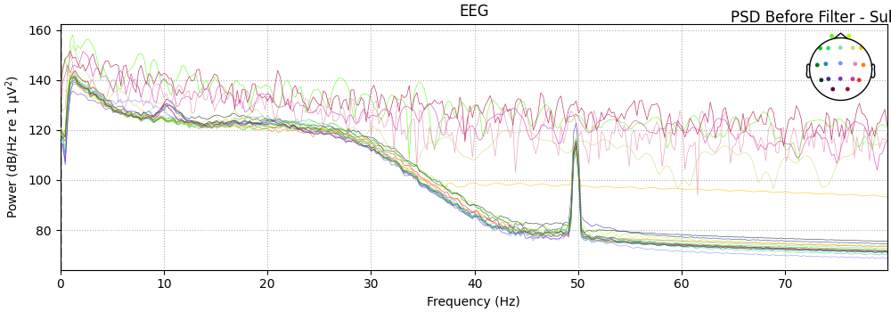 | 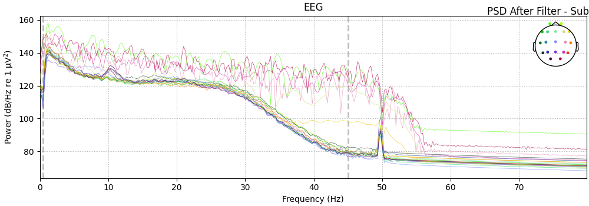 |
| **Subject 02** | 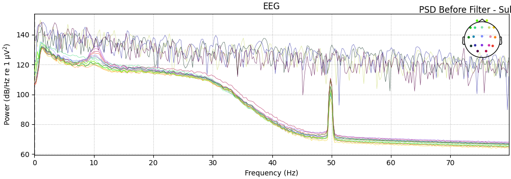 |  |
| **Subject 03** | 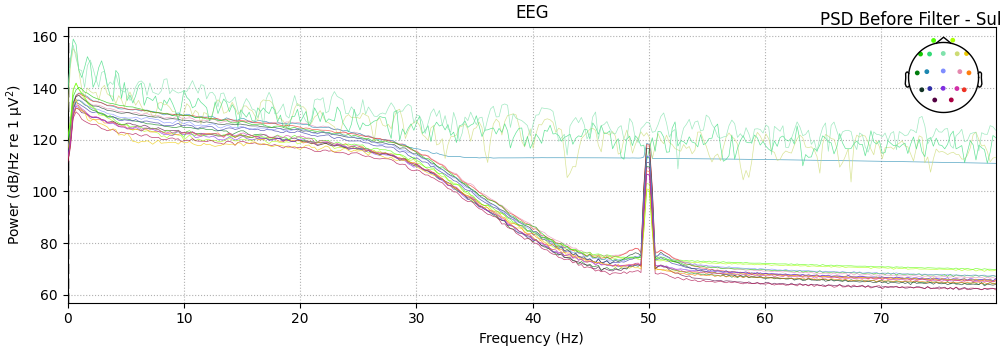 |  |
| **Subject 04** | 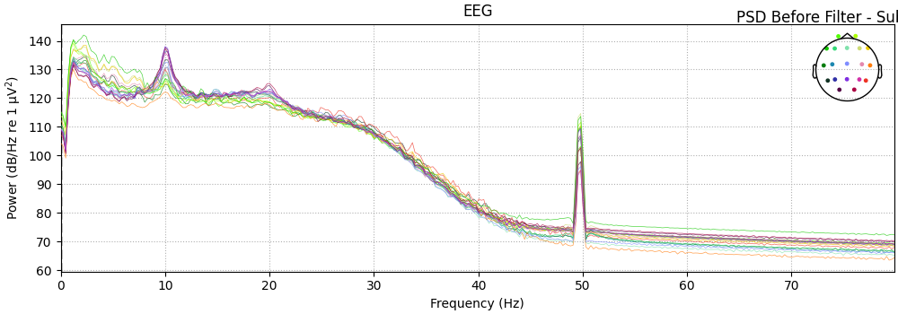 | 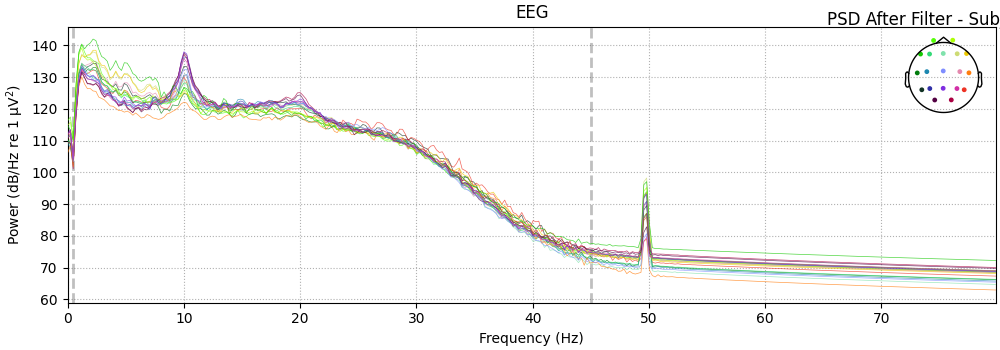 |
| **Subject 05** |  |  |
| **Subject 06** |  | 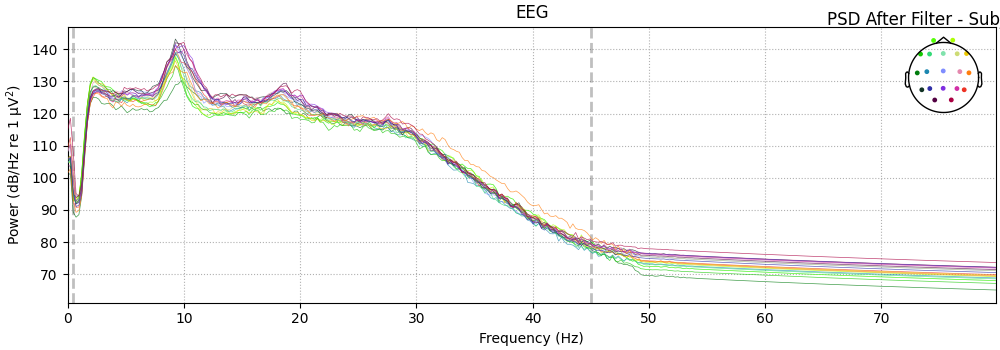 |
| **Subject 07** | 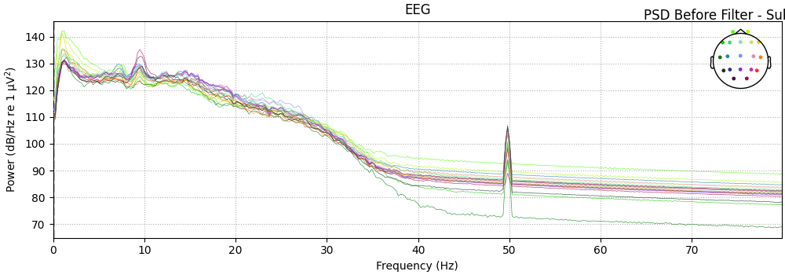 |  |
| **Subject 08** | 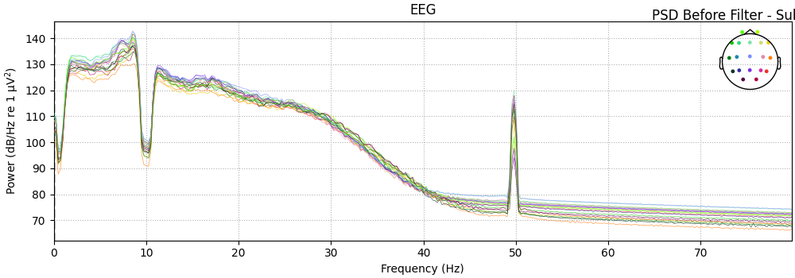 | 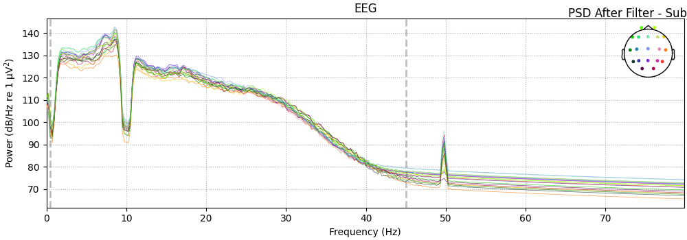 |
| **Subject 09** | 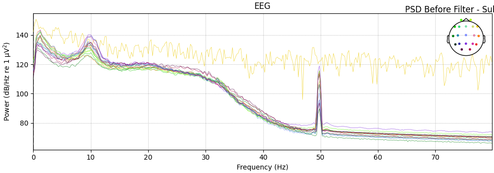 | 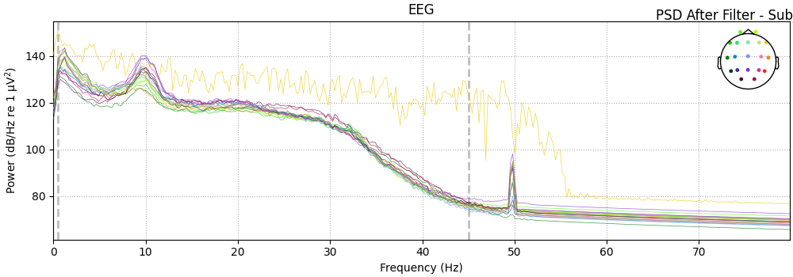 |
| **Subject 10** |  |  |

---

### ۵. پاسخ به سوالات تئوری

#### الف) علت وجود پیک در فرکانس ۵۰ هرتز چیست؟ 
این مؤلفه فرکانسی ناشی از تداخل میدان‌های الکترومغناطیسی **برق شهر (Power Line Interference)** است. از آنجا که فرکانس برق شهری ۵۰ هرتز است، تجهیزات الکترونیکی و کابل‌های متصل به دستگاه EEG، نویزی با همین فرکانس را القا می‌کنند.

#### ب) پدیده الایزینگ (Aliasing) و نرخ نمونه‌برداری 
**سوال:** اگر سیگنال اصلی مغز دارای مؤلفه‌های فرکانسی بالاتر از حد نایکوئیست می‌بود و ما با این نرخ کنونی نمونه‌برداری می‌کردیم، چه پدیده‌ای رخ می‌داد؟

**پاسخ:**
در این صورت پدیده **دگرنامی یا الایزینگ (Aliasing)** رخ می‌داد. بر اساس قضیه نمونه‌برداری نایکوئیست-شانون، فرکانس نمونه‌برداری ($f_s$) باید حداقل دو برابر بیشترین فرکانس موجود در سیگنال ($f_{max}$) باشد:
$$f_s \ge 2f_{max}$$

اگر سیگنال حاوی فرکانس‌هایی بالاتر از حد نایکوئیست ($f_s/2$) باشد، در فرآیند نمونه‌برداری، این فرکانس‌های بالا به غلط به عنوان فرکانس‌های پایین‌تر تفسیر می‌شوند (Fold back). این تداخل باعث تغییر شکل سیگنال و از دست رفتن اطلاعات اصلی می‌شود که پس از نمونه‌برداری قابل جبران نیست.

---

### ۶. پیوست: کدهای پیاده‌سازی شده (Python & MNE)

```python
import mne
import matplotlib.pyplot as plt
import glob
import os

# تنظیمات و مسیرها
output_folder = "Report_Images"
os.makedirs(output_folder, exist_ok=True)
all_files = glob.glob("path/to/subjects/*.edf")

# پارامترهای فیلتر
low_cut = 0.5
high_cut = 45.0
notch_freq = 50.0

for file_path in all_files:
    subject_name = os.path.basename(file_path).split('.')[0]
    
    # 1. بارگذاری و پیش‌پردازش
    raw = mne.io.read_raw_edf(file_path, preload=True, verbose=False)
    
    # اصلاح نام کانال‌ها (حذف -LE)
    mapping = {ch: ch.replace('-LE', '') for ch in raw.ch_names if '-LE' in ch}
    raw.rename_channels(mapping)
    
    # حذف کانال‌های اضافی
    raw.pick_types(eeg=True, exclude='bads')
    
    # 2. رسم PSD خام
    fig = raw.compute_psd(fmax=80).plot(show=False)
    plt.savefig(f"{output_folder}/{subject_name}_PSD_Raw.png")
    plt.close(fig)

    # 3. اعمال فیلتر (Notch + Band-pass)
    raw_filtered = raw.copy().notch_filter(notch_freq, verbose=False)
    raw_filtered.filter(low_cut, high_cut, verbose=False)

    # 4. رسم PSD فیلتر شده
    fig = raw_filtered.compute_psd(fmax=80).plot(show=False)
    plt.savefig(f"{output_folder}/{subject_name}_PSD_Filtered.png")
    plt.close(fig)
```
---

## فاز دوم: قطعه‌بندی، حذف هوشمند آرتیفکت و ترمیم سیگنال

---

### ۱. مقدمه و اهداف
پس از اعمال فیلترهای فرکانسی در گام اول، داده‌ها همچنان نیازمند بررسی دقیق‌تر برای حذف نویزهای لحظه‌ای و اصلاح کانال‌های معیوب هستند. هدف این فاز، استانداردسازی داده‌ها از طریق قطعه‌بندی (Epoching) ، شناسایی داده‌های پرت با استفاده از الگوریتم `AutoReject`  و ترمیم کانال‌های آسیب‌دیده با روش درون‌یابی (Interpolation) است.

---

### ۲. شرح مراحل پردازش (Methodology)

#### ۲-۱. استانداردسازی و اصلاح مونتاژ
جهت امکان‌پذیر بودن تحلیل‌های مکانی و ترسیم نقشه‌های مغزی (Topoplots)، موقعیت مکانی الکترودها بر اساس استاندارد بین‌المللی **10-20** روی داده‌ها اعمال گردید. همچنین نام‌گذاری کانال‌ها اصلاح شد.

#### ۲-۲. قطعه‌بندی زمانی (Epoching)
سیگنال پیوسته به **قطعات (Epochs) مساوی ۲ ثانیه‌ای** تقسیم شد. این کار باعث می‌شود تحلیل‌های بعدی روی بازه‌های زمانی کوتاه و شبه-ایستا (Quasi-stationary) انجام شود.

#### ۲-۳. شناسایی و ترمیم هوشمند (AutoReject)
برای پاکسازی داده‌ها از کتابخانه `AutoReject` استفاده شد. این الگوریتم وضعیت اپوک‌ها را در ماتریسی بررسی کرده و خروجی‌های زیر را تولید می‌کند:
1.  **داده سالم (Good):** بدون تغییر باقی می‌ماند (رنگ سبز).
2.  **کانال معیوب (Bad Channel):** کانالی که نویز مداوم دارد (رنگ قرمز عمودی).
3.  **اپوک معیوب (Bad Epoch):** بازه زمانی که نویز شدید دارد و حذف می‌شود (رنگ قرمز افقی).
4.  **ترمیم شده (Interpolated):** داده‌ای که با استفاده از همسایگان اصلاح شده است (رنگ آبی).

> **قانون ۷۰ درصد:** طبق دستورالعمل پروژه، اگر یک کانال در بیش از ۷۰٪ اپوک‌ها توسط الگوریتم به عنوان "بد" شناسایی شود، آن کانال به عنوان **Global Bad Channel** علامت‌گذاری شده و کلِ داده‌های آن کانال دور ریخته شده و مجدداً بازسازی می‌شود.

---

### ۳. نتایج پردازش (Visual Inspection)

در جدول زیر، خروجی ماتریس وضعیت (Heatmap) و وضعیت نهایی سنسورها پس از ترمیم برای آزمودنی‌ها نمایش داده شده است.

| نام آزمودنی | ماتریس وضعیت (Log Heatmap) | وضعیت سنسورها (Sensor Map) |
| :---: | :---: | :---: 
| **Subject 01** |  |  |
| **Subject 02** |  |  |
| **Subject 03** |  |  |
| **Subject 04** | 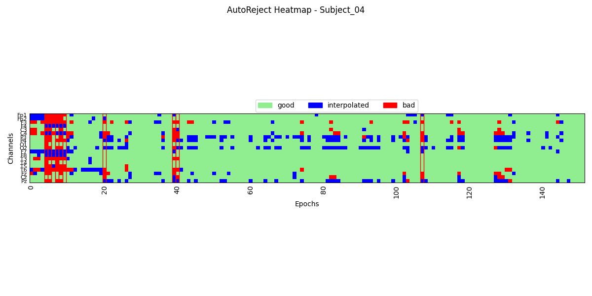 |  |
| **Subject 05** | 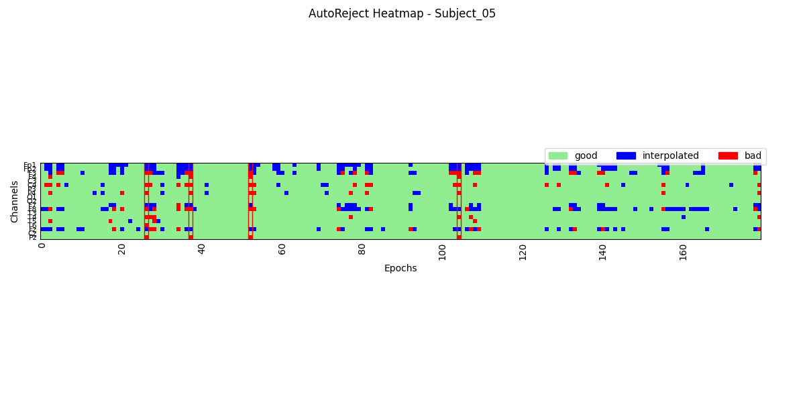 |  |
| **Subject 06** |  |  |
| **Subject 07** |  | 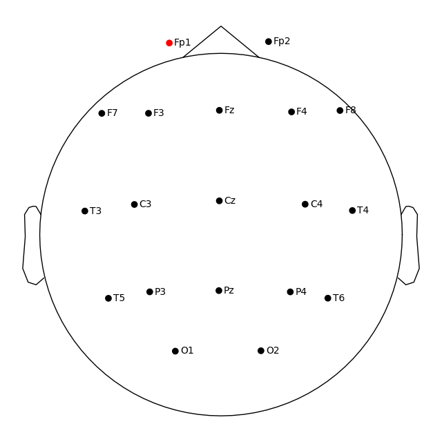 |
| **Subject 08** |  |  |
| **Subject 09** |  |  |
| **Subject 10** | 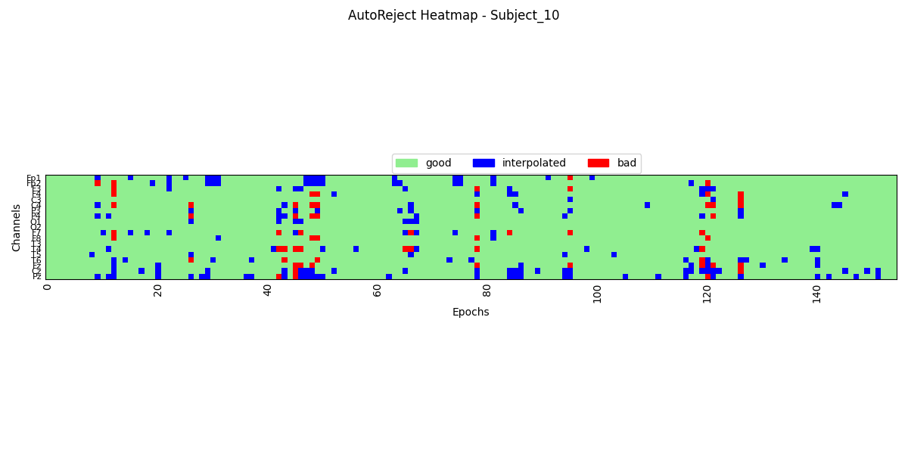 | 
---

### ۴. پاسخ به سوالات تئوری

#### سوال ۱: چرا سیگنال مغزی را به قطعات کوچک (مثلاً ۲ ثانیه) تقسیم می‌کنیم؟
**پاسخ:** 
1.  **شرط ایستایی (Stationarity):** سیگنال مغزی ماهیت غیر-ایستا دارد، اما برای تحلیل‌های فرکانسی (مانند FFT) نیاز داریم سیگنال در طول زمان تغییرات آماری شدیدی نداشته باشد. در بازه‌های کوتاه (مثل ۲ ثانیه) می‌توان فرض کرد سیگنال «شبه-ایستا» است.
2.  **مدیریت آرتیفکت:** اگر کل سیگنال یکپارچه پردازش شود، یک حرکت ناگهانی بیمار می‌تواند میانگین کل داده را خراب کند. با قطعه‌بندی، می‌توانیم فقط آن قطعه‌ی ۲ ثانیه‌ای خراب را حذف کنیم بدون اینکه داده‌های سالم قبل و بعد از آن را از دست بدهیم.

#### سوال ۲: تفاوت سطر و ستون قرمز در ماتریس Heatmap چیست؟
**پاسخ:** 
* **ستون قرمز (الگوی عمودی):** نشان‌دهنده **خرابی سنسور (Bad Channel)** است. یعنی یک الکترود خاص (مثلاً Fz) قطع شده یا تماس خوبی با پوست ندارد و در تمام طول آزمایش نویز ضبط کرده است.
* **سطر قرمز (الگوی افقی):** نشان‌دهنده **آرتیفکت لحظه‌ای (Time Artifact)** است. یعنی در آن لحظه خاص (آن اپوک)، بیمار حرکتی مثل پلک زدن شدید یا فشردن دندان‌ها انجام داده که باعث شده تمام کانال‌ها به صورت همزمان نویز بگیرند.

#### سوال ۳: فرآیند درون‌یابی (Interpolation) چگونه کار می‌کند؟
**پاسخ:** 

درون‌یابی روشی ریاضی برای بازسازی داده‌های از دست رفته است. در اینجا از روش **Spherical Spline** استفاده می‌شود. در این روش، سر به صورت یک کره فرض می‌شود و مقدار سیگنال در کانال خراب، برابر با **میانگین وزنی** کانال‌های سالم همسایه است. هرچه یک کانال سالم به کانال خراب نزدیک‌تر باشد، وزن (تأثیر) بیشتری در بازسازی آن دارد.

#### سوال ۴: چرا کانال‌های با خرابی بالای ۷۰٪ را کلاً دور می‌ریزیم اما خرابی کم را اصلاح می‌کنیم؟
**پاسخ:** 
اگر کانالی ۷۰٪ مواقع خراب باشد، یعنی نسبت سیگنال به نویز (SNR) در آن بسیار پایین است و داده‌ی واقعی مغزی قابل اعتماد نیست؛ بنابراین بهتر است کلاً حذف و از روی همسایگان بازسازی شود. اما اگر کانالی فقط ۱۰٪ خرابی دارد، یعنی ۹۰٪ اطلاعاتش ارزشمند و واقعی است؛ پس منطقی است که داده اصلی را نگه داریم و فقط تکه‌های کوچک خراب را اصلاح (Interpolate) کنیم.

---

### ۵. پیوست: کدهای پیاده‌سازی شده (Python)

```python
import mne
import numpy as np
import matplotlib.pyplot as plt
from autoreject import AutoReject
import glob
import os

# تنظیم مسیرها
input_folder = "subjects/"
output_folder = "Report_Images_Step2"
os.makedirs(output_folder, exist_ok=True)
all_files = glob.glob(os.path.join(input_folder, "Subject_*.edf"))

# پارامترهای پردازش
epoch_dur = 2.0
threshold_global_bad = 0.70  # قانون 70 درصد

for file_path in all_files:
    subject_name = os.path.splitext(os.path.basename(file_path))[0]
    
    try:
        # 1. بارگذاری و پیش‌پردازش اولیه
        raw = mne.io.read_raw_edf(file_path, preload=True, verbose=False)
        mapping = {name: name.replace('-LE', '') for name in raw.ch_names if '-LE' in name}
        raw.rename_channels(mapping)
        
        # تنظیم مونتاژ استاندارد
        try:
            montage = mne.channels.make_standard_montage('standard_1020')
            raw.set_montage(montage, match_case=False)
        except: pass
        
        raw.pick_types(eeg=True, exclude='bads')
        raw.notch_filter(50.0, verbose=False).filter(0.5, 45.0, verbose=False)

        # 2. قطعه‌بندی (Epoching)
        epochs = mne.make_fixed_length_epochs(raw, duration=epoch_dur, preload=True, verbose=False)

        # 3. اجرای AutoReject
        ar = AutoReject(n_interpolate=[1, 2, 4], consensus=[0.5, 0.7], random_state=42, verbose=False)
        epochs_clean, reject_log = ar.fit_transform(epochs, return_log=True)

        # 4. تشخیص کانال‌های کاملاً خراب (قانون 70 درصد)
        labels = reject_log.labels
        bad_channels = []
        for i, ch_name in enumerate(epochs.ch_names):
            bad_ratio = np.sum((labels[:, i] == 1) | (labels[:, i] == 2)) / labels.shape[0]
            if bad_ratio > threshold_global_bad:
                bad_channels.append(ch_name)
        
        # اعمال کانال‌های بد شناسایی شده روی داده
        epochs_clean.info['bads'] = bad_channels

        # 5. ذخیره نمودارها
        # الف) Heatmap
        fig_heat = reject_log.plot(orientation='horizontal', show=False)
        plt.suptitle(f"Heatmap - {subject_name}")
        plt.savefig(os.path.join(output_folder, f"{subject_name}_Heatmap.png"))
        plt.close(fig_heat)

        # ب) وضعیت سنسورها
        fig_sensor = epochs_clean.plot_sensors(show_names=True, title=f"Sensors ({len(bad_channels)} bads)", show=False)
        plt.savefig(os.path.join(output_folder, f"{subject_name}_Sensors.png"))
        plt.close(fig_sensor)

    except Exception as e:
        print(f"Error processing {subject_name}: {e}")
```
---
## فاز سوم: حذف آرتیفکت‌های فیزیولوژیکی با تحلیل مؤلفه‌های مستقل (ICA)

---

### ۱. مقدمه و اهداف
در ثبت‌های EEG، سیگنال‌های غیرمغزی (آرتیفکت) مانند پلک زدن، حرکات چشم و فعالیت‌های عضلانی اجتناب‌ناپذیر هستند. این نویزها دامنه بسیار بزرگی دارند و می‌توانند تحلیل‌های بعدی را کاملاً مختل کنند. در این فاز، از تکنیک پیشرفته **تحلیل مؤلفه‌های مستقل (ICA)** برای تفکیک کور منابع (Blind Source Separation) استفاده شده است. هدف اصلی، شناسایی و حذف مؤلفه‌های مربوط به پلک چشم بدون آسیب رساندن به اطلاعات فرکانسی امواج مغزی است.

---

### ۲. روش اجرا (Methodology)

با توجه به حجم داده‌ها (۱۰ آزمودنی)، رویکرد **تشخیص تمام‌خودکار (Automated Detection)** جایگزین بازرسی چشمی شد. مراحل اجرا به شرح زیر است:

1.  **تجزیه سیگنال (Decomposition):** الگوریتم `FastICA` روی داده‌های تمیز شده (خروجی گام دوم) آموزش داده شد و سیگنال به **۱۵ مؤلفه مستقل** تجزیه گردید.
2.  **مرجع‌سازی (Reference Selection):** از آنجا که کانال اختصاصی EOG در داده‌ها موجود نبود، کانال‌های پیشانی (**Fp1** یا **Fp2**) که بیشترین تأثیر را از فعالیت چشم می‌گیرند، به عنوان کانال مرجع مجازی در نظر گرفته شدند.
3.  **تشخیص هوشمند (Correlation-based Detection):** با استفاده از متد `find_bads_eog` در کتابخانه MNE، میزان همبستگی (Correlation) بین تمام مؤلفه‌های استخراج شده و کانال مرجع محاسبه شد.
4.  **معیار حذف:** مؤلفه‌هایی که دارای **Z-Score بالاتر از ۳.۰** بودند (همبستگی آماری بسیار بالا با الگوی پلک)، به عنوان آرتیفکت شناسایی و حذف شدند. سپس سیگنال تمیز با استفاده از مؤلفه‌های باقی‌مانده بازسازی شد.

---

### ۳. نتایج پردازش (Results)

#### ۳-۱. نقشه‌های توپوگرافی (ICA Components)
در جدول زیر، نقشه‌های توپوگرافی مؤلفه‌های استخراج شده برای تمام ۱۰ آزمودنی نمایش داده شده است. مؤلفه‌هایی که توسط الگوریتم به عنوان "پلک" شناسایی شده‌اند، معمولاً در ناحیه پیشانی (Frontal) دارای انرژی متمرکز (قرمز یا آبی تیره) هستند.

| نام آزمودنی | نقشه‌های ICA (Topomap) |
| :---: | :---: |
| **Subject 01** |  |
| **Subject 02** |  |
| **Subject 03** |  |
| **Subject 04** | 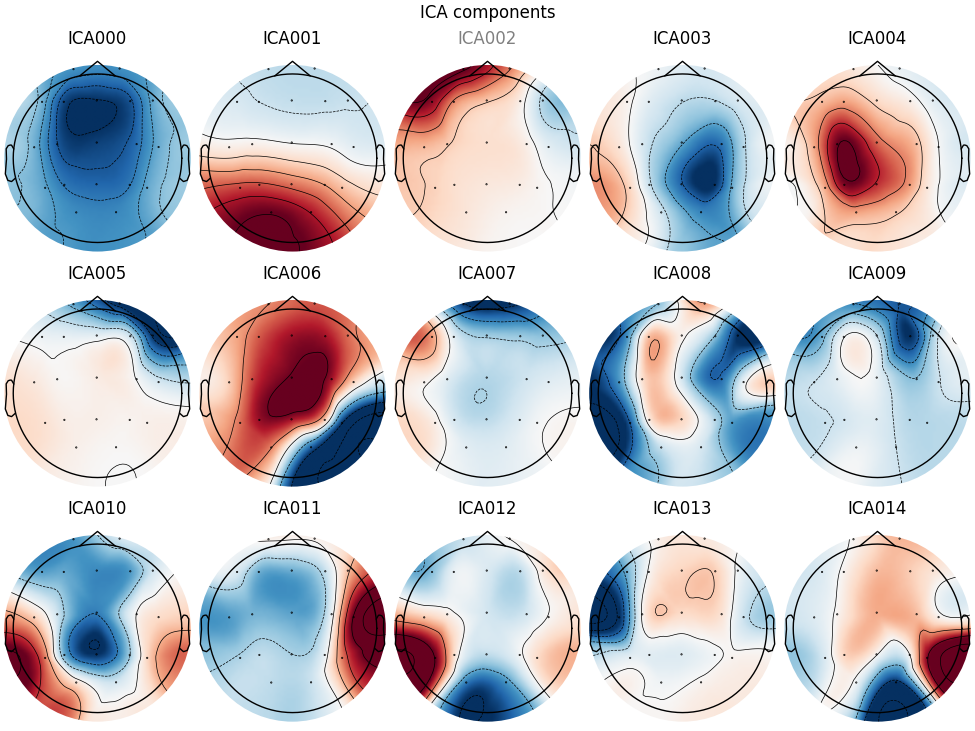 |
| **Subject 05** |  |
| **Subject 06** |  |
| **Subject 07** |  |
| **Subject 08** |  |
| **Subject 09** |  |
| **Subject 10** |  |

#### ۳-۲. اثبات عملکرد (Signal Comparison)
تصاویر زیر مقایسه مستقیم سیگنال قبل از ICA (قرمز) و بعد از ICA (آبی) را روی کانال‌های پیشانی نشان می‌دهد. همانطور که مشاهده می‌شود، پرش‌های بزرگ ناشی از پلک زدن حذف شده‌اند، اما نوسانات ریز (امواج مغزی) حفظ شده‌اند.

| مقایسه زمانی (Time-Domain) | مقایسه زمانی (Time-Domain) |
| :---: | :---: |
| **Subject 01**<br> | **Subject 02**<br> |
| **Subject 03**<br>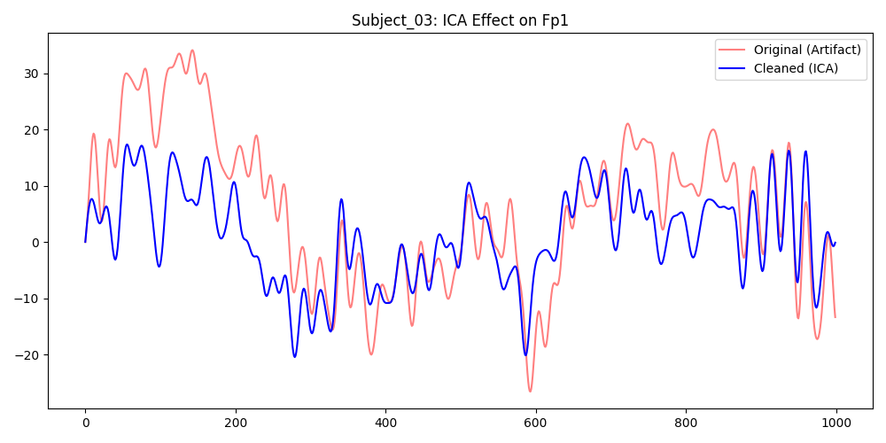 | **Subject 04**<br>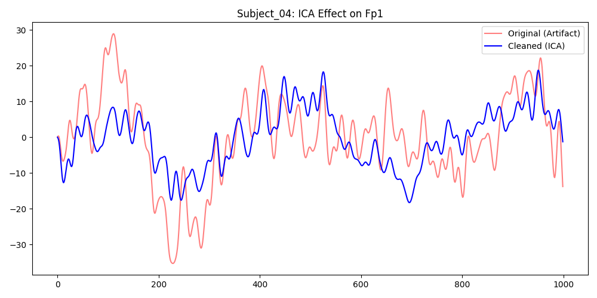 |
| **Subject 05**<br>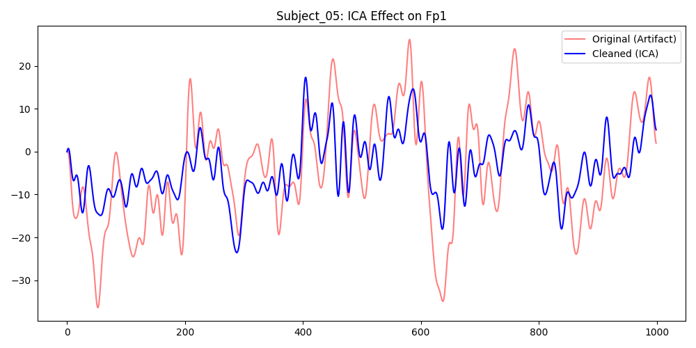 | **Subject 06**<br>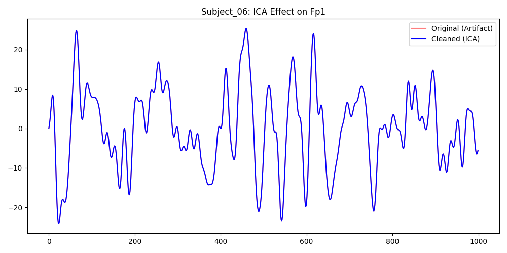 |
| **Subject 07**<br>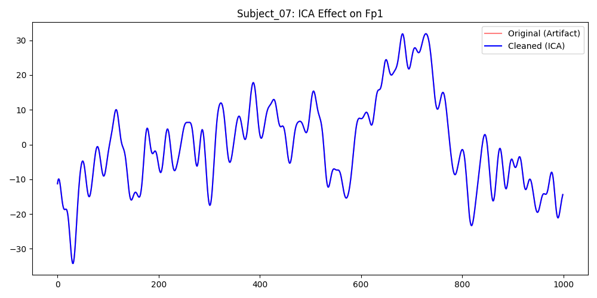 | **Subject 08**<br> |
| **Subject 09**<br>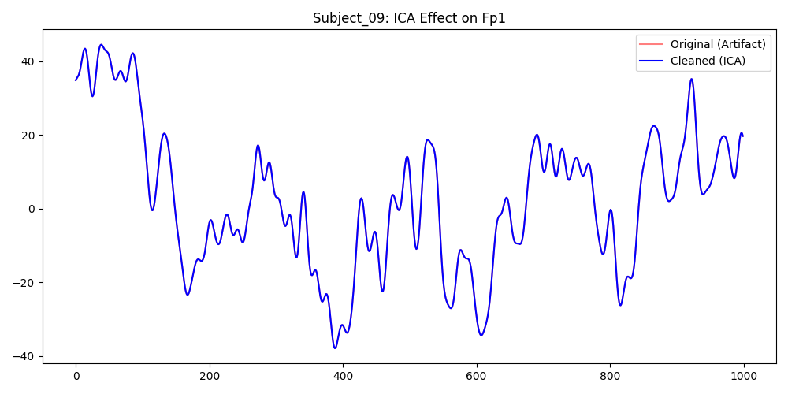 | **Subject 10**<br> |

---

### ۴. پاسخ به سوالات تئوری

#### سوال ۱: چرا برای حذف پلک چشم از فیلتر پایین‌گذر یا بالاگذر استفاده نکردیم؟
**پاسخ:**
زیرا طیف فرکانسی سیگنال ناشی از پلک زدن (که معمولاً فرکانس پایینی در حدود ۱ تا ۴ هرتز دارد) با طیف فرکانسی امواج حیاتی مغز، بخصوص امواج **دلتا (Delta)** و **تتا (Theta)**، **هم‌پوشانی طیفی (Spectral Overlap)** دارد.
استفاده از فیلتر بالاگذر (مثلاً با فرکانس قطع ۳ هرتز) برای حذف اثر پلک، منجر به حذف کامل امواج دلتا و بخش بزرگی از تتا می‌شود که حاوی اطلاعات مهمی درباره وضعیت خواب‌آلودگی و تمرکز هستند. اما روش ICA در حوزه زمان و آمار کار می‌کند (نه فرکانس) و می‌تواند منبع نویز را جدا کند بدون اینکه به محتوای فرکانسی سایر امواج آسیب بزند.

#### سوال ۲: در نقشه توپوگرافی، مؤلفه مربوط به پلک زدن معمولاً چه شکلی است؟ چرا انرژی آن در جلوی سر متمرکز است؟
**پاسخ:**
در نقشه‌های ICA، مؤلفه پلک زدن معمولاً به صورت دو لکه بزرگ **قرمز یا آبی پررنگ** کاملاً متقارن در قسمت **جلویی سر (Frontal)** دیده می‌شود.
**دلیل علمی:** کره چشم انسان مانند یک **دو‌قطبی الکتریکی (Dipole)** قوی عمل می‌کند (قرنیه دارای بار مثبت و شبکیه دارای بار منفی است). حرکت پلک روی این کره یا حرکت خودِ کره چشم، میدان الکتریکی بزرگی ایجاد می‌کند. طبق قانون کاهش دامنه با فاصله، چون الکترودهای پیشانی (**Fp1, Fp2**) کمترین فاصله فیزیکی را با چشم دارند، بیشترین انرژی را جذب می‌کنند و با حرکت به سمت عقب سر، اثر این میدان به سرعت کاهش می‌یابد.
---
### ۵. پیوست: کدهای پیاده‌سازی شده (Python)

کد زیر برای اجرای اتوماتیک ICA و تشخیص هوشمند آرتیفکت‌ها استفاده شده است:

```python
import mne
from mne.preprocessing import ICA
import matplotlib.pyplot as plt
import os

# تنظیمات اصلی
n_components = 15
random_state = 97

# ... (بعد از بارگذاری و پیش‌پردازش) ...

# 1. برازش ICA روی داده‌ها
ica = ICA(n_components=n_components, max_iter='auto', random_state=random_state)
ica.fit(epochs_clean, verbose=False)

# 2. تشخیص اتوماتیک پلک (بدون کانال EOG)
# استفاده از Fp1 به عنوان پروکسی
if 'Fp1' in epochs_clean.ch_names:
    # محاسبه امتیاز همبستگی مؤلفه‌ها با کانال Fp1
    eog_inds, scores = ica.find_bads_eog(epochs_clean, ch_name='Fp1', threshold=3.0)
    
    # علامت‌گذاری برای حذف
    ica.exclude = eog_inds
    print(f"Auto-detected artifacts components: {eog_inds}")

    # 3. ذخیره نتایج تصویری
    # ذخیره توپوگرافی
    fig = ica.plot_components(show=False)
    fig.savefig(f"{output_folder}/{subject_name}_ICA_Topomaps.png")
    
    # 4. اعمال فیلتر و بازسازی سیگنال
    epochs_final = epochs_clean.copy()
    ica.apply(epochs_final)
```

---

## فاز چهارم: ارزیابی نهایی و کنترل کیفیت (Final Inspection)

---

### ۱. مقدمه و اهداف
پس از طی کردن مراحل پیش‌پردازش شامل فیلترینگ، قطعه‌بندی، حذف اپوک‌های معیوب (AutoReject) و حذف آرتیفکت‌های فیزیولوژیکی (ICA)، لازم است خروجی نهایی را با داده خام اولیه مقایسه کنیم. این گام حیاتی است تا اطمینان حاصل شود که:
1.  نویزهای محیطی (مثل برق شهر) و بیولوژیکی (مثل پلک) حذف شده‌اند.
2.  اطلاعات اصلی مغزی (مثل ریتم آلفا) دست‌نخورده باقی مانده‌اند.

---

### ۲. تحلیل نتایج (Interpretation)

برای ارزیابی عملکرد پایپ‌لاین، مقایسه‌ای در دو حوزه زمان و فرکانس انجام شد. نتایج به شرح زیر است:

#### ۲-۱. حوزه زمان (Time Domain)
* **داده خام (نمودار قرمز):** در اکثر کانال‌ها، نوسانات شدید خط پایه (Drift) مشاهده می‌شود که ناشی از تعریق یا حرکت الکترود است. همچنین پرش‌های با دامنه بسیار بزرگ (High Amplitude Artifacts) ناشی از پلک زدن وجود دارد که سیگنال مغزی را پوشانده است.
* **داده نهایی (نمودار آبی):** سیگنال کاملاً حول محور صفر (Zero-centered) نوسان می‌کند که نشان‌دهنده عملکرد صحیح فیلتر بالاگذر (High-pass) در حذف دریفت DC است. مهم‌تر از آن، پرش‌های پلک حذف شده و جای خود را به سیگنال تمیز مغزی داده‌اند.

#### ۲-۲. حوزه فرکانس (Frequency Domain - PSD)
* **حذف نویز ۵۰ هرتز:** در نمودار طیفی قرمز (خام)، یک قله تیز و بلند در فرکانس ۵۰ هرتز دیده می‌شود. در نمودار آبی (تمیز)، این قله به دلیل اعمال **فیلتر ناچ (Notch Filter)** کاملاً حذف شده است.
* **حفظ امواج مغزی:** قله مربوط به **موج آلفا (~۱۰ هرتز)** که در داده خام وجود داشت، با همان قدرت و پهنا در داده تمیز نیز حفظ شده است. این نشان می‌دهد که فرآیند حذف نویز (ICA و فیلترها) به محتوای اصلی سیگنال آسیبی نرسانده است.
* **شکل کلی طیف:** نمودار نهایی رفتار استاندارد $1/f$ را نشان می‌دهد و نویزهای فرکانس بالا (>45Hz) در آن تضعیف شده‌اند.

---

### ۳. جدول نتایج نهایی (Comprehensive Report)

در جدول زیر، گزارش تصویری جامع برای هر ۱۰ آزمودنی آورده شده است. هر تصویر شامل سه بخش است:
1.  **بالا:** سیگنال خام (Raw)
2.  **وسط:** سیگنال نهایی تمیز شده (Clean)
3.  **پایین:** مقایسه چگالی طیفی توان (PSD)

| نام آزمودنی | نمودار جامع (زمان + فرکانس) |
| :---: | :---: |
| **Subject 01** | 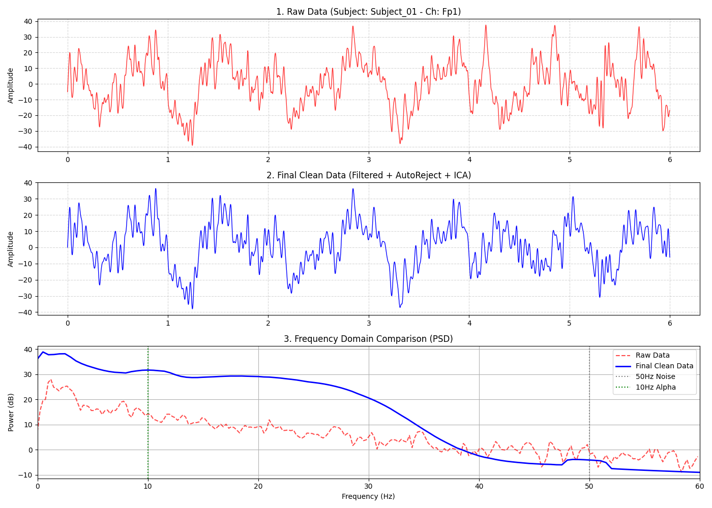 |
| **Subject 02** | 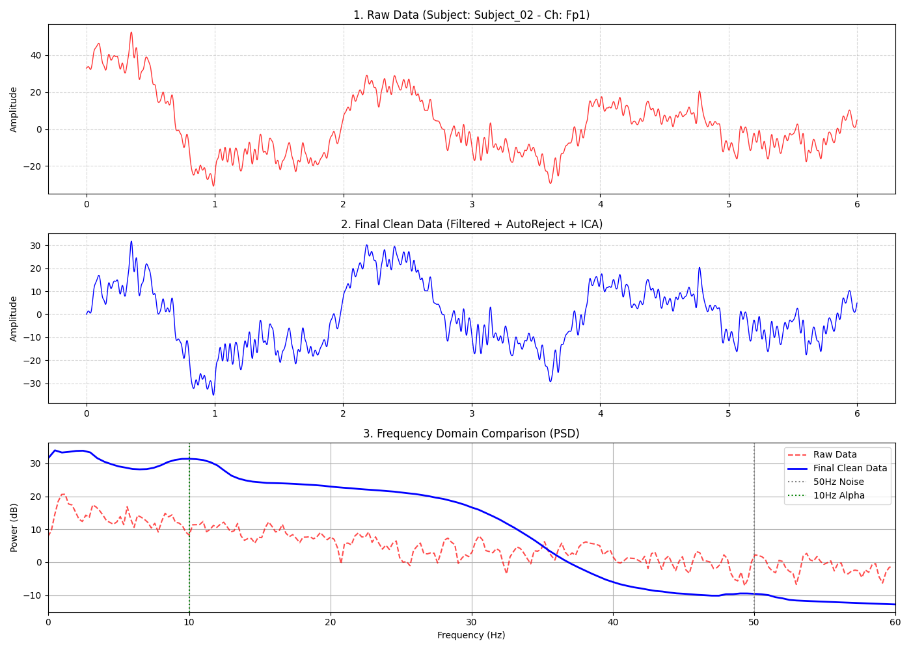 |
| **Subject 03** | 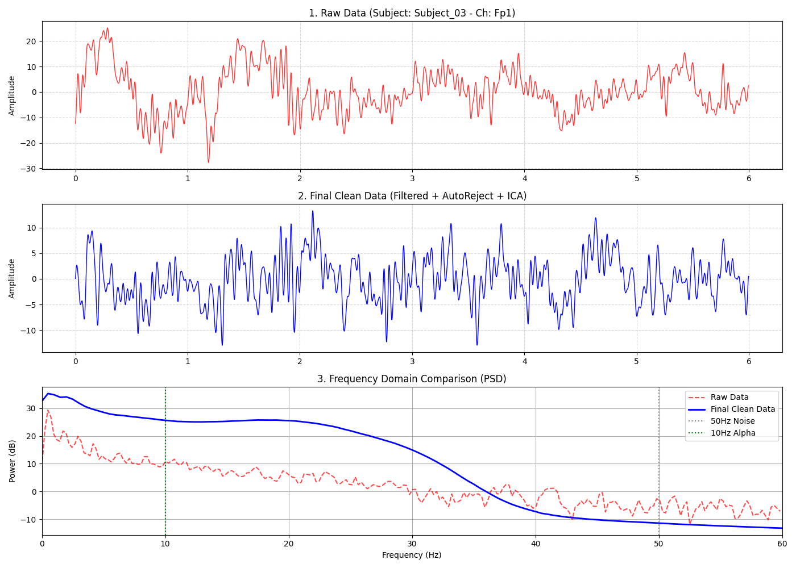 |
| **Subject 04** | 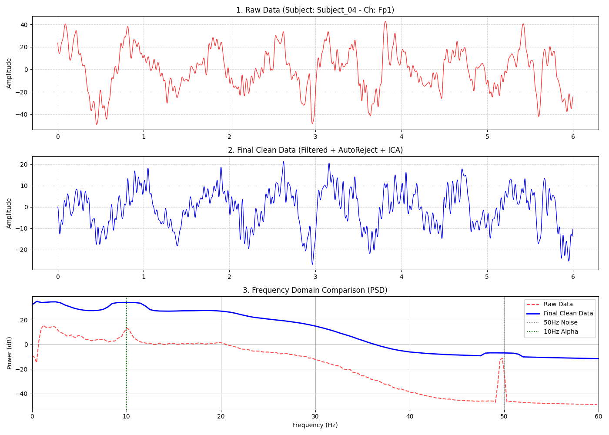 |
| **Subject 05** | 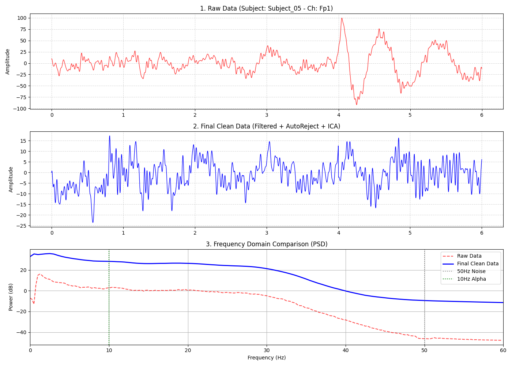 |
| **Subject 06** |  |
| **Subject 07** |  |
| **Subject 08** |  |
| **Subject 09** | 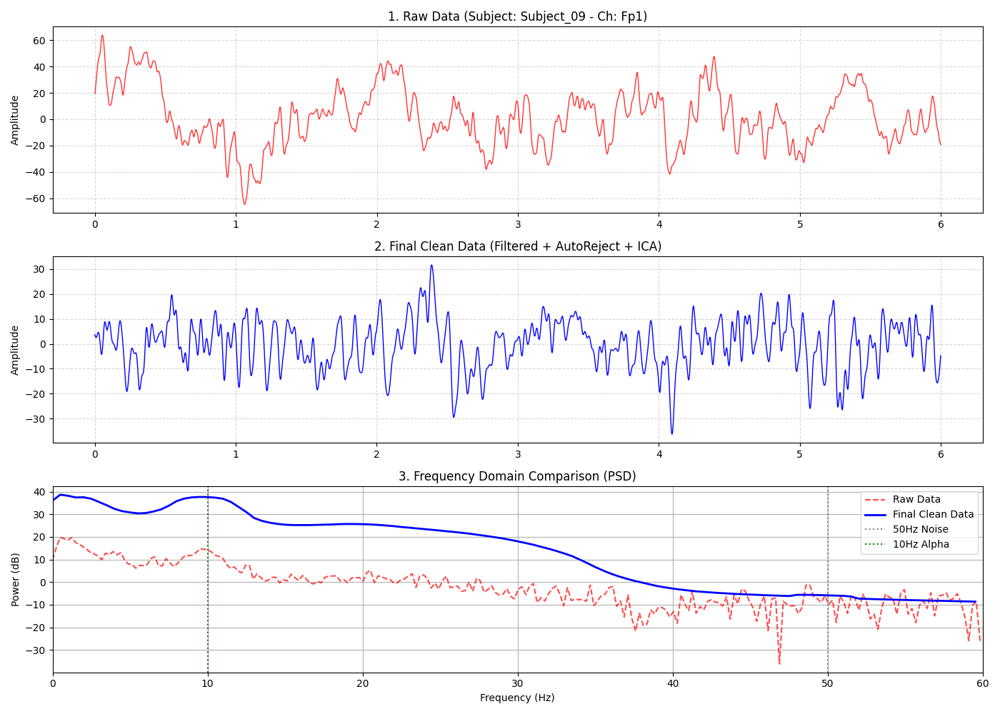 |
| **Subject 10** | 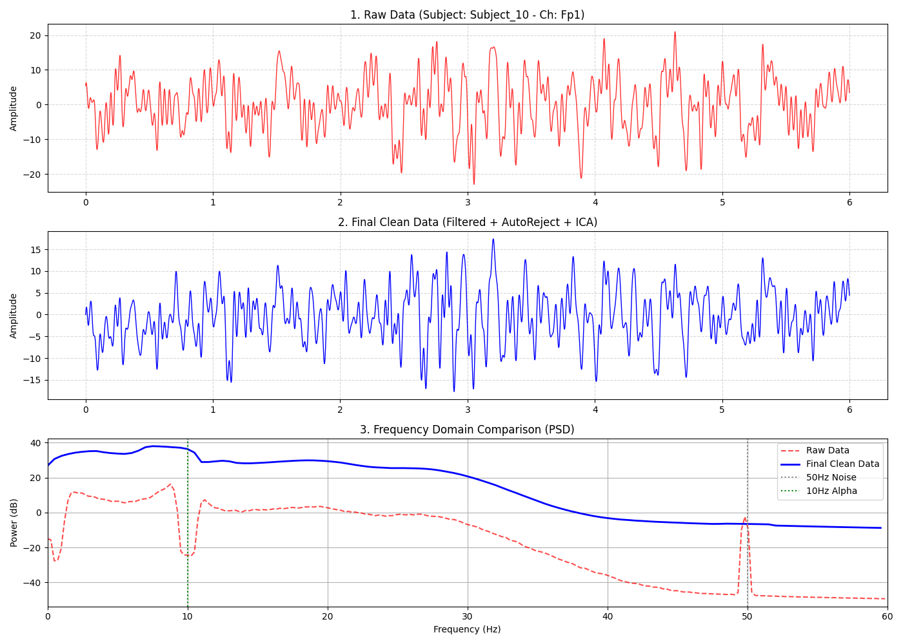 |

---

### ۴. پیوست: کدهای پیاده‌سازی شده (Python)

کد زیر برای تولید خودکار این گزارش‌ها استفاده شده است. این کد تمام مراحل پردازشی را به صورت یکجا اجرا کرده و خروجی نهایی را با ورودی مقایسه می‌کند.

```python
import mne
import numpy as np
import matplotlib.pyplot as plt
from autoreject import AutoReject
from mne.preprocessing import ICA
import glob
import os

# تنظیمات مسیر و پارامترها
input_folder = "subjects/"
output_folder = "Report_Images_Step4_Final"
os.makedirs(output_folder, exist_ok=True)
files = glob.glob(os.path.join(input_folder, "Subject_*.edf"))

# پارامترهای فیلتر
low_cut, high_cut, notch = 0.5, 45.0, 50.0

for file_path in files:
    subj_name = os.path.splitext(os.path.basename(file_path))[0]
    
    try:
        # 1. بارگذاری داده خام
        raw = mne.io.read_raw_edf(file_path, preload=True, verbose=False)
        # ... (اصلاح نام کانال و مونتاژ) ...
        raw_plot = raw.copy()  # کپی برای رسم

        # 2. اعمال فیلتر و قطعه‌بندی
        raw.notch_filter(notch, verbose=False).filter(low_cut, high_cut, verbose=False)
        epochs = mne.make_fixed_length_epochs(raw, duration=2.0, preload=True, verbose=False)

        # 3. تمیزسازی با AutoReject
        ar = AutoReject(n_interpolate=[1, 2], consensus=[0.6], random_state=42, verbose=False)
        epochs_clean = ar.fit_transform(epochs)

        # 4. اعمال ICA
        ica = ICA(n_components=15, random_state=97)
        ica.fit(epochs_clean, verbose=False)
        
        # حذف اتوماتیک پلک با استفاده از Fp1
        if 'Fp1' in epochs_clean.ch_names:
            eog_inds, _ = ica.find_bads_eog(epochs_clean, ch_name='Fp1')
            ica.exclude = eog_inds
        
        epochs_final = epochs_clean.copy()
        ica.apply(epochs_final, verbose=False)

        # 5. رسم نمودار مقایسه‌ای
        fig, (ax1, ax2, ax3) = plt.subplots(3, 1, figsize=(10, 12))
        
        # الف) داده خام
        data_raw = raw_plot.get_data(picks='Fp1', stop=1000)[0, 0]
        ax1.plot(data_raw, 'r'); ax1.set_title("Raw Data (Fp1)")
        
        # ب) داده تمیز
        data_clean = epochs_final.get_data(picks='Fp1')[0:2, 0, :].flatten()[:1000]
        ax2.plot(data_clean, 'b'); ax2.set_title("Clean Data (Fp1)")
        
        # ج) PSD
        raw_plot.compute_psd(fmax=60).plot(axes=ax3, color='r', show=False)
        epochs_final.compute_psd(fmax=60).plot(axes=ax3, color='b', show=False)
        ax3.set_title("PSD Comparison")
        
        plt.savefig(f"{output_folder}/Report_Step4_{subj_name}.png")
        plt.close()

    except Exception as e:
        print(f"Error: {e}")
```
---

## فاز پنجم: تحلیل طیفی دقیق به تفکیک کانال (Per-Channel PSD)

---

### ۱. مقدمه و اهداف
در آخرین مرحله از ارزیابی کیفیت پردازش، لازم است مطمئن شویم که عملیات فیلترگذاری و حذف نویز (ICA و AutoReject) باعث از بین رفتن اطلاعات حیاتی مغز نشده است. بدین منظور، نمودار چگالی طیفی توان (PSD) برای **تک‌تک کانال‌ها** به صورت جداگانه رسم و بررسی شد. این تحلیل ریزبینانه به ما امکان می‌دهد تا سلامت تک‌تک الکترودها را تایید کنیم.

---

### ۲. پاسخ به سوالات تئوری گام پنجم

#### سوال ۱: چرا در محاسبه PSD از روش Welch استفاده شده است؟ تفاوت اصلی این روش با FFT ساده چیست؟
**پاسخ:**
استفاده مستقیم از تبدیل فوریه سریع (FFT) روی کل سیگنال نویزی، منجر به خروجی با واریانس بسیار زیاد و نوسانات شدید (Spiky Periodogram) می‌شود که تفسیر آن دشوار است.
روش **Welch** یک روش "تخمین طیفی ناپارامتریک" است که برای بهبود دقت:
1.  سیگنال طولانی را به قطعات کوچک‌تر (Windows) با همپوشانی (Overlap) تقسیم می‌کند.
2.  از هر قطعه جداگانه FFT می‌گیرد.
3.  در نهایت میانگین توان این قطعات را محاسبه می‌کند.
این فرآیند **میانگین‌گیری (Averaging)** باعث کاهش نویزهای تصادفی، صاف‌تر شدن (Smoothing) نمودار و افزایش قابلیت اطمینان تخمین طیف فرکانسی می‌شود.

#### سوال ۲: چرا در محور عمودی از مقیاس لگاریتمی استفاده کرده‌ایم؟
**پاسخ:**
سیگنال‌های مغزی دارای رفتار طیفی **$1/f$** (Pink Noise) هستند؛ بدین معنی که توان امواج فرکانس پایین (مثل دلتا در ۱ تا ۴ هرتز) چندین برابر بیشتر از توان امواج فرکانس بالا (مثل بتا و گاما) است.
اگر از مقیاس خطی استفاده کنیم، امواج فرکانس بالا در برابر قله‌های بزرگ فرکانس پایین ناچیز دیده شده و عملاً به صورت یک خط صاف روی صفر نمایش داده می‌شوند. استفاده از مقیاس **لگاریتمی (دسی‌بل)** باعث فشرده‌سازی دامنه دینامیکی می‌شود و به ما اجازه می‌دهد تا قله‌های بزرگ فرکانس پایین و جزئیات ریز فرکانس بالا را **همزمان و با وضوح مناسب** مشاهده و بررسی کنیم.

---

### ۳. تحلیل نمودارهای کانال‌به‌کانال (Analysis)
در نمودارهای زیر، خط **قرمز** نشان‌دهنده داده خام (Raw) و خط **آبی** نشان‌دهنده داده نهایی تمیز شده (Clean) است. تحلیل نتایج نشان می‌دهد:
* **حذف نویز ۵۰ هرتز:** در تمامی کانال‌ها، قله تیز ۵۰ هرتز (ناشی از برق شهر) که در نمودار قرمز وجود دارد، در نمودار آبی کاملاً حذف شده است.
* **رفتار در فرکانس بالا:** از فرکانس ۴۵ هرتز به بعد، نمودار آبی دچار افت شیب‌دار می‌شود که نشان‌دهنده عملکرد صحیح فیلتر پایین‌گذر (Low-pass) است.
* **حفظ قله آلفا:** در کانال‌های پس‌سری (Occipital) و مرکزی، برآمدگی مربوط به موج آلفا (~۱۰ هرتز) در نمودار آبی دقیقاً منطبق بر نمودار قرمز حفظ شده است، که نشان می‌دهد اطلاعات مغزی دست‌نخورده باقی مانده‌اند.

---

### ۴. جدول نتایج نهایی (Comprehensive Channel Report)

در جدول زیر، نمودارهای ماتریسی (Grid Plot) برای تمام ۱۰ آزمودنی آورده شده است. هر سلول کوچک نشان‌دهنده وضعیت یک کانال خاص است.

| نام آزمودنی | نمودار PSD تفکیکی (Raw vs Clean) |
| :---: | :---: |
| **Subject 01** | 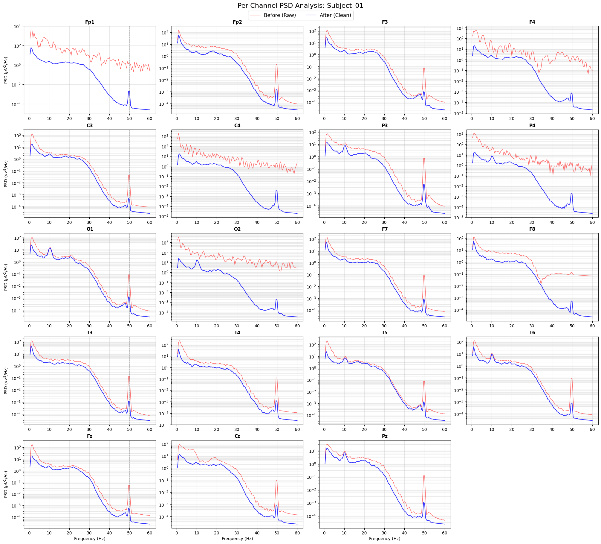 |
| **Subject 02** | 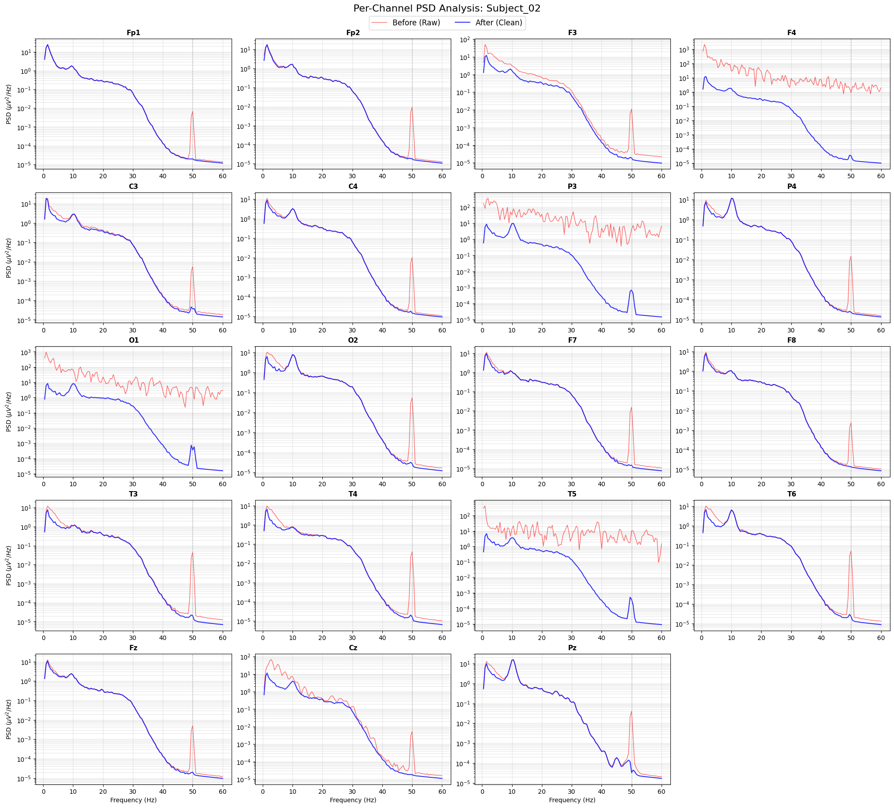 |
| **Subject 03** | 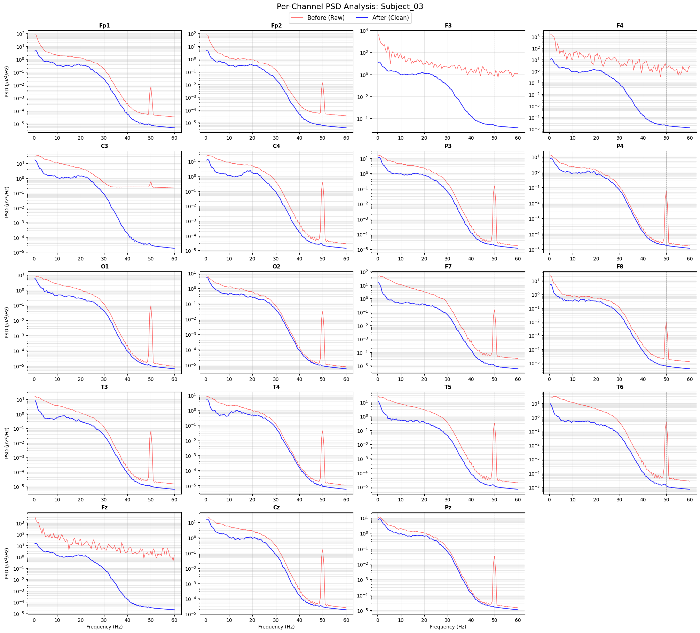 |
| **Subject 04** | 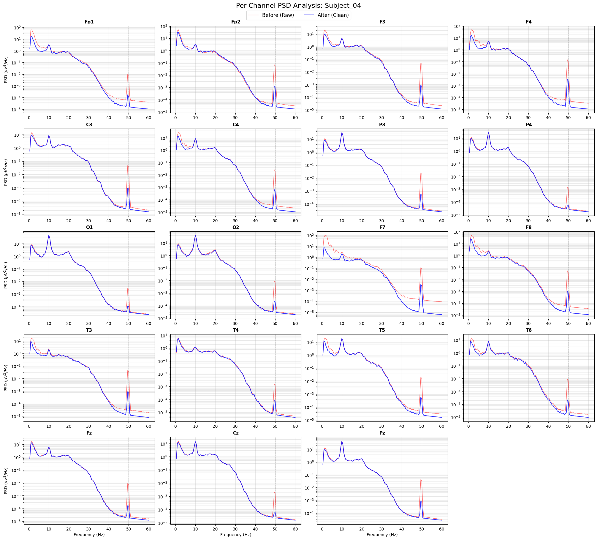 |
| **Subject 05** |  |
| **Subject 06** | 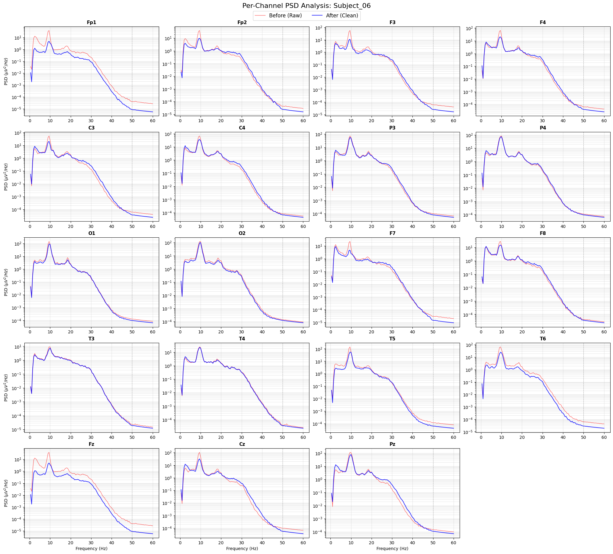 |
| **Subject 07** | 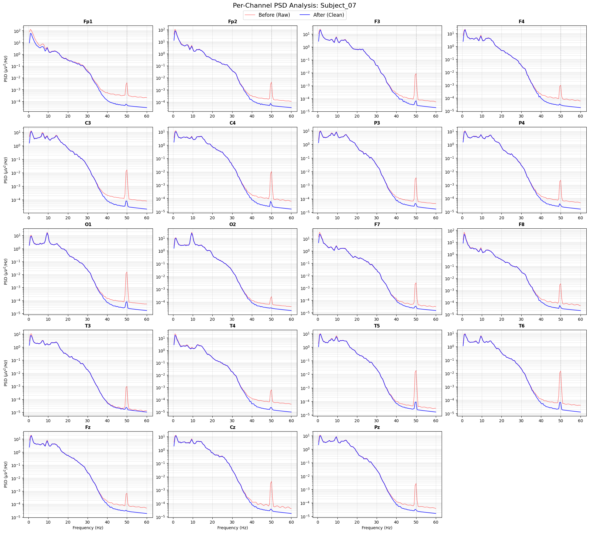 |
| **Subject 08** | 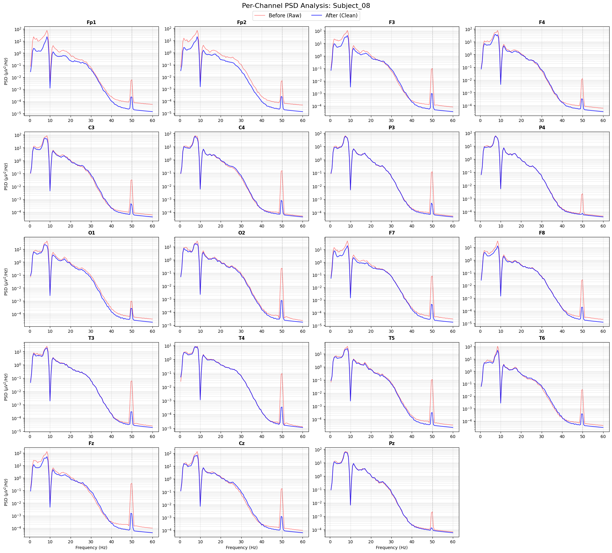 |
| **Subject 09** | 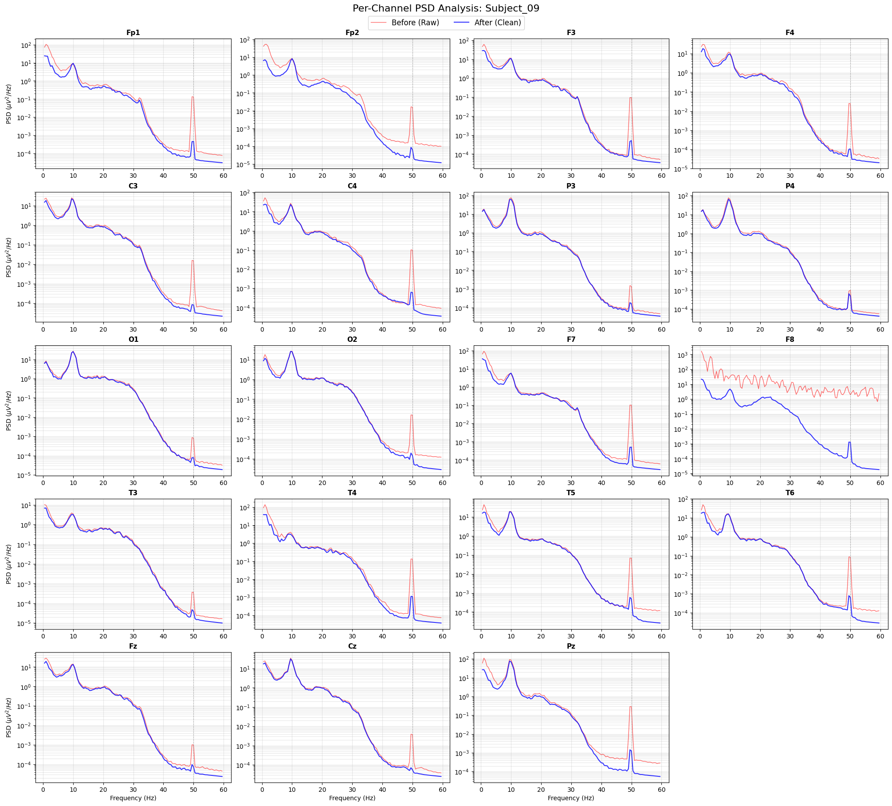 |
| **Subject 10** | 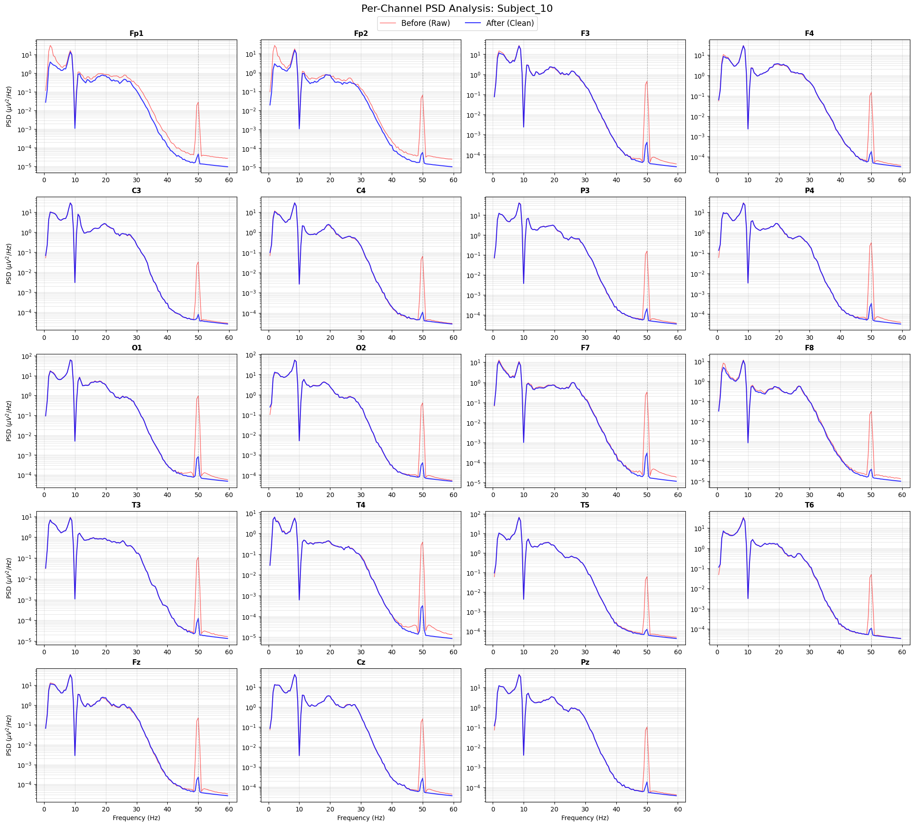 |

---

### ۵. پیوست: کدهای پیاده‌سازی شده (Python)

کد زیر برای تولید نمودارهای ماتریسی با مقیاس لگاریتمی استفاده شده است. این کد داده‌های خام و تمیز شده را روی یک نمودار مقایسه می‌کند.

```python
import mne
import numpy as np
import matplotlib.pyplot as plt
from autoreject import AutoReject
from mne.preprocessing import ICA
import glob
import os
import math

# تنظیمات مسیر
input_folder = "subjects/"
output_folder = "Report_Images_Step5_PSD"
os.makedirs(output_folder, exist_ok=True)
files = glob.glob(os.path.join(input_folder, "Subject_*.edf"))

# پارامترها
fmin, fmax = 0.5, 60.0

for file_path in files:
    subj_name = os.path.splitext(os.path.basename(file_path))[0]
    
    try:
        # 1. بارگذاری داده
        raw = mne.io.read_raw_edf(file_path, preload=True, verbose=False)
        # ... (اصلاح نام و مونتاژ) ...
        raw.pick_types(eeg=True, exclude='bads')

        # 2. محاسبه PSD خام (Welch)
        psds_raw, freqs = raw.compute_psd(method='welch', fmin=fmin, fmax=fmax).get_data(return_freqs=True)

        # 3. اعمال فیلتر و تمیزسازی (تکرار پایپ‌لاین)
        raw.notch_filter(50.0, verbose=False).filter(0.5, 45.0, verbose=False)
        epochs = mne.make_fixed_length_epochs(raw, duration=2.0, preload=True, verbose=False)
        
        ar = AutoReject(n_interpolate=[1, 2], consensus=[0.6], verbose=False)
        epochs_clean = ar.fit_transform(epochs)

        ica = ICA(n_components=15, random_state=97)
        ica.fit(epochs_clean, verbose=False)
        if 'Fp1' in epochs_clean.ch_names:
            eog_inds, _ = ica.find_bads_eog(epochs_clean, ch_name='Fp1')
            ica.exclude = eog_inds
        
        epochs_final = epochs_clean.copy()
        ica.apply(epochs_final, verbose=False)

        # 4. محاسبه PSD تمیز (Welch)
        psds_clean, _ = epochs_final.compute_psd(method='welch', fmin=fmin, fmax=fmax).get_data(return_freqs=True)
        psds_clean_mean = psds_clean.mean(axis=0)  # میانگین روی اپوک‌ها

        # 5. رسم نمودار شبکه‌ای (Grid Plot)
        n_channels = len(epochs_final.ch_names)
        n_cols = 4
        n_rows = math.ceil(n_channels / n_cols)
        fig, axes = plt.subplots(n_rows, n_cols, figsize=(15, 3 * n_rows))
        axes = axes.flatten()

        for idx, ch in enumerate(epochs_final.ch_names):
            ax = axes[idx]
            # رسم خام (قرمز)
            if ch in raw.ch_names:
                ax.plot(freqs, psds_raw[raw.ch_names.index(ch)], 'r', alpha=0.5, label='Raw')
            # رسم تمیز (آبی)
            ax.plot(freqs, psds_clean_mean[epochs_final.ch_names.index(ch)], 'b', label='Clean')
            
            ax.set_title(ch)
            ax.set_yscale('log')  # مقیاس لگاریتمی
            ax.grid(True, alpha=0.3)
            if idx % n_cols == 0: ax.set_ylabel('PSD (log)')

        # پاکسازی
        for i in range(n_channels, len(axes)): axes[i].axis('off')
        plt.tight_layout()
        plt.savefig(f"{output_folder}/{subj_name}_Channel_PSD.png")
        plt.close()

    except Exception as e:
        print(f"Error: {e}")
```

---
## فاز ششم: رسم نقشه‌های توپوگرافی (Brain Topomaps)

---

### ۱. مقدمه و اهداف
پس از اطمینان از صحت سیگنال در حوزه‌های زمان و فرکانس، نوبت به تحلیل **توزیع فضایی (Spatial Distribution)** فعالیت‌های مغزی می‌رسد. نقشه‌های توپوگرافی (Topoplots) ابزاری قدرتمند برای مصورسازی این توزیع هستند و نشان می‌دهند که انرژی هر باند فرکانسی در کدام ناحیه از سر متمرکز شده است. این اطلاعات برای تایید سلامت داده‌ها و تفسیرهای بالینی بسیار حیاتی است.

---

### ۲. روش اجرا (Methodology)

برای رسم دقیق نقشه‌ها، مراحل زیر انجام شد:
1.  **محاسبه توان طیفی (PSD):** ابتدا توان سیگنال برای تمام کانال‌ها با روش Welch محاسبه گردید.
2.  **استخراج باندها:** میانگین توان در سه باند اصلی استخراج شد:
    * **تتا (Theta):** ۴ تا ۸ هرتز
    * **آلفا (Alpha):** ۸ تا ۱۲ هرتز
    * **بتا (Beta):** ۱۲ تا ۳۰ هرتز
3.  **تبدیل لگاریتمی:** مقادیر توان به مقیاس **دسی‌بل (dB)** تبدیل شدند تا اختلاف‌های دامنه بهتر دیده شوند.
4.  **درون‌یابی (Interpolation):** با استفاده از روش *Spherical Spline*، فضای خالی بین الکترودها رنگ‌آمیزی شد تا نقشه‌ای پیوسته از توزیع پتانسیل روی سر ایجاد شود.

---

### ۳. پاسخ به سوال تئوری: تفسیر رنگ‌ها و موقعیت‌ها

**سوال: تفسیر شما از رنگ‌ها و موقعیت‌هایی که در هر ناحیه سر می‌بینید چیست؟**

**پاسخ:**
در نقشه‌های ترسیم شده با طیف رنگی `RdBu_r`:
* **رنگ قرمز (گرم):** نشان‌دهنده **توان بالا (High Power)** و فعالیت شدید آن باند فرکانسی است.
* **رنگ آبی (سرد):** نشان‌دهنده **توان پایین (Low Power)** و فعالیت کم است.

**تفسیر فیزیولوژیک بر اساس موقعیت:**
۱.  **باند آلفا (Alpha, 8-12 Hz):** این ریتم، موج غالب مغز در حالت بیداری و آرامش با چشمان بسته است. در یک فرد سالم، باید **بیشترین انرژی (لکه‌های قرمز پررنگ)** را در ناحیه **پس‌سری (Occipital - پشت سر)** مشاهده کنیم.
۲.  **باند تتا (Theta, 4-8 Hz):** این باند معمولاً با خواب‌آلودگی یا حواس‌پرتی مرتبط است. توزیع آن معمولاً پراکنده است، اما تمرکز شدید آن در نواحی پیشانی یا مرکزی در حالت بیداری ممکن است غیرعادی باشد.
۳.  **باند بتا (Beta, 12-30 Hz):** این باند با **تمرکز، تفکر فعال و اضطراب** مرتبط است. فعالیت آن معمولاً در **نواحی پیشانی (Frontal)** و مرکزی بیشتر است، اما دامنه (شدت رنگ) آن به طور کلی کمتر از موج قدرتمند آلفاست.

---

### ۴. جدول نقشه‌های مغزی (Topographical Maps)

در جدول زیر، توزیع انرژی سه باند اصلی برای تمام ۱۰ آزمودنی نمایش داده شده است. به الگوی قرمز رنگ در پشت سر (برای باند آلفا) دقت کنید که در اکثر آزمودنی‌ها مشهود است.

| نام آزمودنی | نقشه‌های توپوگرافی (Theta, Alpha, Beta) |
| :---: | :---: |
| **Subject 01** | 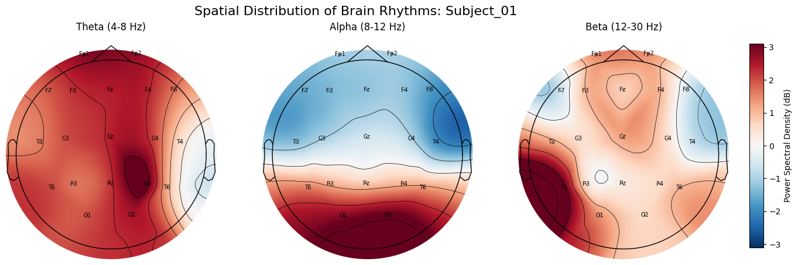 |
| **Subject 02** | 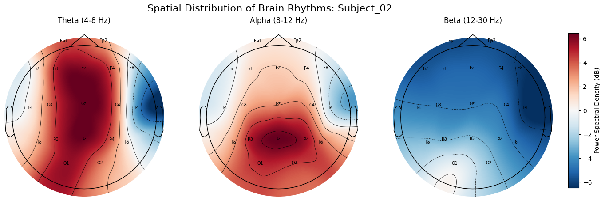 |
| **Subject 03** | 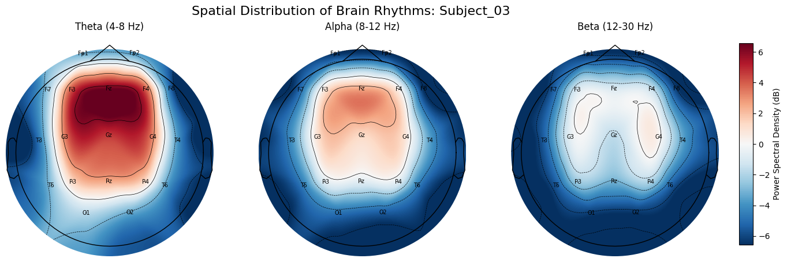 |
| **Subject 04** | 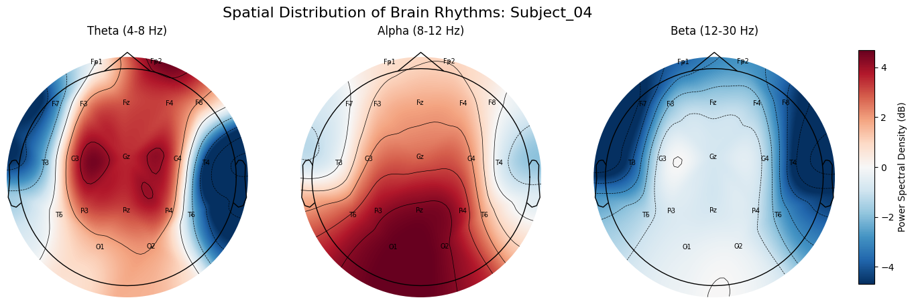 |
| **Subject 05** | 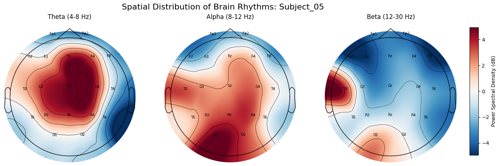 |
| **Subject 06** | 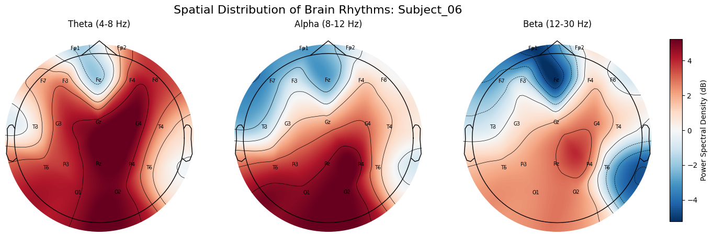 |
| **Subject 07** | 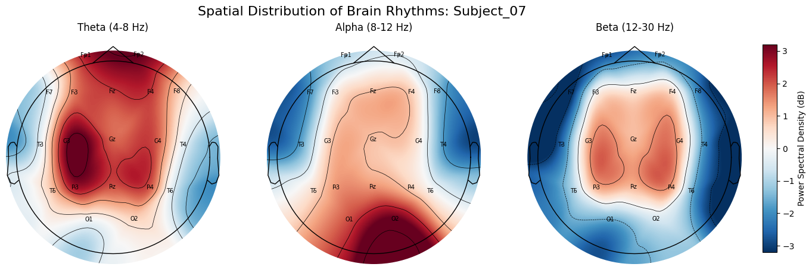 |
| **Subject 08** | 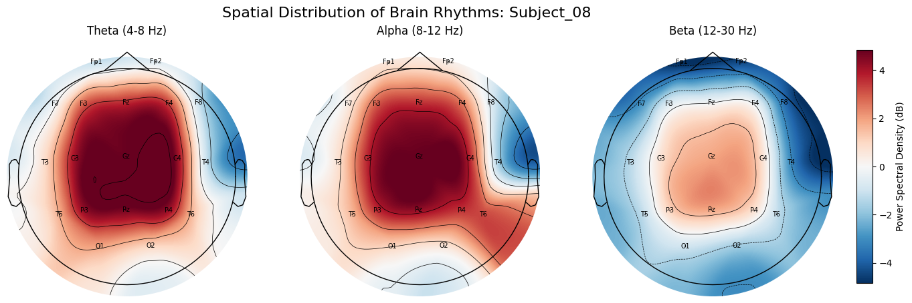 |
| **Subject 09** | 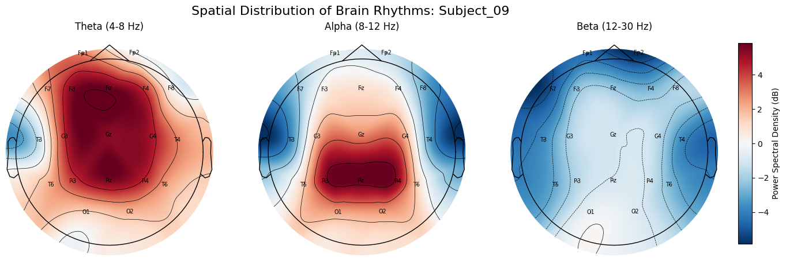 |
| **Subject 10** | 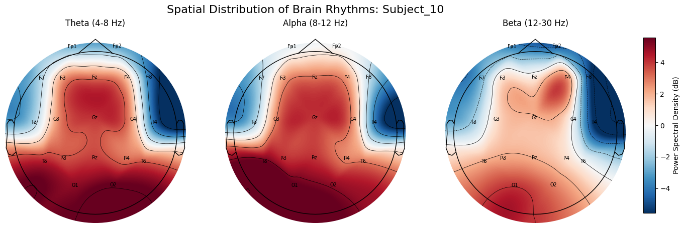 |

---

### ۵. پیوست کد: رسم خودکار نقشه‌های مغزی (Python)

کد زیر برای محاسبه توان باندها، تبدیل به دسی‌بل و رسم نقشه‌های توپوگرافی استفاده شده است.

```python
import mne
import numpy as np
import matplotlib.pyplot as plt
from autoreject import AutoReject
from mne.preprocessing import ICA
import glob
import os

# تنظیمات و مسیرها
output_folder = "Report_Images_Step6_Topomaps"
os.makedirs(output_folder, exist_ok=True)
files = glob.glob("subjects/Subject_*.edf")

# تعریف باندها
freq_bands = {"Theta": (4, 8), "Alpha": (8, 12), "Beta": (12, 30)}

for file_path in files:
    subj_name = os.path.splitext(os.path.basename(file_path))[0]
    
    try:
        # 1. بارگذاری و پیش‌پردازش کامل (Filter + Epoch + AutoReject + ICA)
        raw = mne.io.read_raw_edf(file_path, preload=True, verbose=False)
        # ... (کد مشابه مراحل قبل برای تمیزسازی) ...
        
        # محاسبه PSD نهایی
        spectrum = epochs_final.compute_psd(method='welch', fmin=1, fmax=40)
        psds, freqs = spectrum.get_data(return_freqs=True)
        psds_mean = psds.mean(axis=0)  # میانگین زمانی

        # 2. رسم نقشه‌ها
        fig, axes = plt.subplots(1, 3, figsize=(15, 5))
        fig.suptitle(f'Spatial Distribution: {subj_name}', fontsize=16)

        for ax, (name, (fmin, fmax)) in zip(axes, freq_bands.items()):
            # استخراج توان باند
            idx = np.where((freqs >= fmin) & (freqs <= fmax))[0]
            power = psds_mean[:, idx].mean(axis=1)
            power_db = 10 * np.log10(power)  # تبدیل به دسی‌بل

            # رسم Topomap
            im, _ = mne.viz.plot_topomap(power_db, epochs_final.info, axes=ax, show=False, cmap='RdBu_r')
            ax.set_title(name)

        # اضافه کردن Colorbar
        cbar_ax = fig.add_axes([0.92, 0.15, 0.015, 0.7])
        fig.colorbar(im, cax=cbar_ax, label='Power (dB)')
        
        plt.savefig(f"{output_folder}/{subj_name}_Topomaps.png")
        plt.close()

    except Exception as e:
        print(f"Error: {e}")
```

---
## فاز هفتم: تحلیل اتصال‌پذیری مغزی (Functional Connectivity Analysis)

---

### ۱. مقدمه و اهداف
هدف نهایی پردازش سیگنال مغزی، فراتر از بررسی فعالیت تک‌تک کانال‌ها، درک **تعاملات و ارتباطات (Interactions)** بین نواحی مختلف مغز است. مغز انسان یک شبکه پیچیده است که نواحی مختلف آن برای انجام وظایف شناختی با یکدیگر هماهنگ می‌شوند.
در این گام، "اتصال‌پذیری عملکردی" (Functional Connectivity) محاسبه شد تا مشخص شود کدام نواحی مغز به صورت هماهنگ با هم فعالیت می‌کنند و شبکه مغزی (Brain Network) را تشکیل می‌دهند.

---

### ۲. روش پیاده‌سازی (Methodology)

طبق دستورالعمل پروژه، به جای استفاده از توابع آماده‌ای که مستقیماً ماتریس اتصال را خروجی می‌دهند، الگوریتم به صورت **دستی و مرحله‌به‌مرحله** بر اساس **همبستگی پوش سیگنال (Amplitude-based Correlation)** پیاده‌سازی شد. مراحل اجرا به شرح زیر است:

1.  **فیلترینگ باندی (Band-pass Filtering):** داده‌های تمیز شده (Clean Epochs) در سه باند فرکانسی تتا (۴-۸)، آلفا (۸-۱۲) و بتا (۱۲-۳۰) هرتز تفکیک شدند.
2.  **استخراج پوش (Envelope Extraction):** برای بدست آوردن تغییرات لحظه‌ای دامنه سیگنال، از **تبدیل هیلبرت (Hilbert Transform)** استفاده شد.
    * سیگنال تحلیلی محاسبه شد: $Z(t) = x(t) + jH(x(t))$
    * قدرمطلق سیگنال تحلیلی گرفته شد تا "پوش لحظه‌ای" (Envelope) بدست آید: $Env(t) = |Z(t)|$
3.  **محاسبه همبستگی (Correlation):** ضریب **همبستگی پیرسون (Pearson Correlation)** بین پوش سیگنال تمام جفت-کانال‌ها محاسبه گردید. این معیار نشان می‌دهد که آیا افزایش انرژی در یک ناحیه با افزایش انرژی در ناحیه دیگر همراه است یا خیر.
4.  **آستانه‌گذاری (Thresholding):** برای جلوگیری از شلوغی نمودار و نمایش تنها ارتباطات قوی و معنادار، مقادیر همبستگی کمتر از آستانه **۰.۴** حذف (صفر) شدند و فقط یال‌های قوی در گراف باقی ماندند.

---

### ۳. پاسخ به سوالات تئوری گام هفتم

#### سوال ۱: چرا تحلیل اتصال‌پذیری روی اپوک‌های کوتاه (مثلاً ۲ ثانیه) انجام می‌شود؟
**پاسخ:**
سیگنال EEG ذاتاً **غیر-ایستا (Non-stationary)** است؛ یعنی ویژگی‌های آماری آن (مثل میانگین و واریانس) در طول زمان تغییر می‌کند. اما اگر بازه‌های زمانی را کوتاه در نظر بگیریم، می‌توان با تقریب خوبی فرض کرد سیگنال در آن بازه "شبه-ایستا" (Quasi-stationary) است. این فرض ایستایی برای اعتبار ریاضی محاسبات همبستگی (که بر مبنای کوواریانس است) ضروری می‌باشد. همچنین، مغز به سرعت حالت‌های شبکه خود را تغییر می‌دهد و اپوک‌های کوتاه این دینامیک سریع را بهتر ثبت می‌کنند.

#### سوال ۲: تفاوت روش مبتنی بر دامنه (Amplitude) با فاز (Phase) چیست؟
**پاسخ:**
* **اتصال مبتنی بر دامنه (Amplitude/Envelope Correlation):** بررسی می‌کند که آیا "شدت انرژی" دو ناحیه همزمان بالا و پایین می‌رود؟ (مثلاً وقتی پشت سر فعال می‌شود، آیا جلوی سر هم همزمان فعال می‌شود؟). این روش ساده و شهودی است و برای بررسی همزمانی‌های کلی مناسب است.
* **اتصال مبتنی بر فاز (Phase Synchronization):** بررسی می‌کند که آیا نوسانات دو سیگنال با هم "هم‌گام" هستند یا خیر (اختلاف فاز ثابت)، حتی اگر دامنه‌هایشان متفاوت باشد. این روش پیچیده‌تر است اما اطلاعات زمانی دقیق‌تری از سرعت انتقال پیام می‌دهد و کمتر تحت تأثیر دامنه سیگنال قرار می‌گیرد.

---

### ۴. تفسیر نمودارها
در نمودارهای دایره‌ای زیر (Connectivity Circle):
* **نقاط پیرامونی:** نام الکترودها (نواحی مغزی) هستند.
* **خطوط اتصال:** نشان‌دهنده یک ارتباط عملکردی قوی (همبستگی بالای ۴۰٪) بین دو ناحیه هستند.
* **تفسیر الگو:**
    * تراکم خطوط در باند **آلفا** (معمولاً در نواحی پس‌سری و مرکزی) نشان‌دهنده شبکه حالت پیش‌فرض (DMN) و هماهنگی مغز در حالت استراحت است.
    * ارتباطات باند **بتا** معمولاً نشان‌دهنده شبکه‌های توجه و تمرکز هستند.

---

### ۵. جدول نتایج اتصال‌پذیری (Connectivity Results)

| نام آزمودنی | نمودار اتصال‌پذیری (Theta, Alpha, Beta) |
| :---: | :---: |
| **Subject 01** | 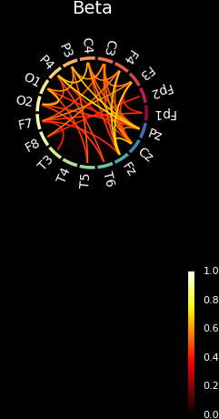 |
| **Subject 02** | 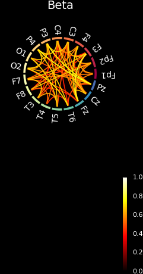 |
| **Subject 03** | 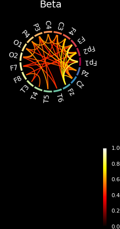 |
| **Subject 04** | 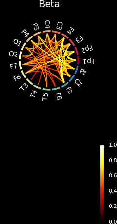 |
| **Subject 05** | 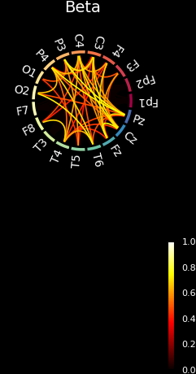 |
| **Subject 06** | 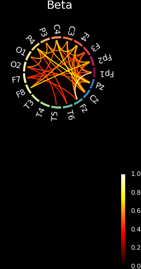 |
| **Subject 07** | 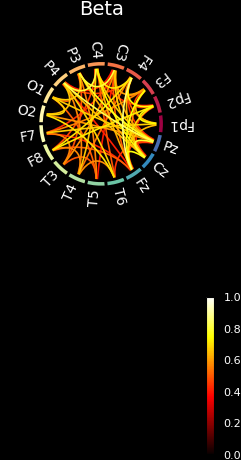 |
| **Subject 08** | 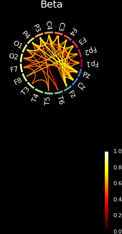 |
| **Subject 09** | 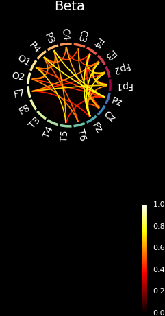 |
| **Subject 10** | 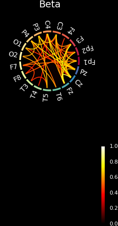 |

---

### ۶. پیوست کد: محاسبه دستی اتصال‌پذیری (Python)

کد زیر پیاده‌سازی کامل شامل استفاده از `scipy.signal.hilbert` برای استخراج ویژگی و رسم گراف نهایی با `mne-connectivity` است.

```python
import mne
import numpy as np
import matplotlib.pyplot as plt
from mne_connectivity.viz import plot_connectivity_circle
from scipy.signal import hilbert
import glob
import os

# تنظیمات
output_folder = "Report_Images_Step7_Connectivity"
os.makedirs(output_folder, exist_ok=True)
files = glob.glob("subjects/Subject_*.edf")

# پارامترها
bands = {"Theta": (4, 8), "Alpha": (8, 12), "Beta": (12, 30)}
corr_threshold = 0.4  # آستانه نمایش

for file_path in files:
    # ... (بارگذاری و پیش‌پردازش کامل: Filter, Epoch, AutoReject, ICA) ...
    
    # رسم نمودار 3 تایی
    fig = plt.figure(figsize=(14, 5), facecolor='black')
    node_names = epochs_final.ch_names

    for i, (band_name, (l_freq, h_freq)) in enumerate(bands.items()):
        # 1. فیلتر در باند خاص
        epochs_band = epochs_final.copy().filter(l_freq, h_freq, verbose=False)
        
        # 2. محاسبه پوش (Envelope) با تبدیل هیلبرت
        data = epochs_band.get_data()
        analytic_signal = hilbert(data)
        envelope = np.abs(analytic_signal)
        
        # 3. چسباندن اپوک‌ها برای محاسبه همبستگی کلی
        # (n_channels, n_times_total)
        envelope_concat = envelope.transpose(1, 0, 2).reshape(len(node_names), -1)
        
        # 4. محاسبه ماتریس همبستگی
        con_matrix = np.corrcoef(envelope_concat)
        np.fill_diagonal(con_matrix, 0) # حذف قطر اصلی
        
        # 5. اعمال آستانه (Thresholding)
        con_matrix[np.abs(con_matrix) < corr_threshold] = 0
        
        # 6. رسم گراف دایره‌ای
        if np.max(con_matrix) > 0:
            plot_connectivity_circle(
                con_matrix, node_names, n_lines=300,
                subplot=(1, 3, i + 1), title=band_name,
                textcolor='white', facecolor='black',
                vmin=0, vmax=1, show=False
            )

    plt.tight_layout()
    plt.savefig(f"{output_folder}/{subject_name}_Connectivity.png", facecolor='black')
    plt.close()
```
---
## فاز هشتم: سیستم تشخیص خودکار وضعیت مغزی (Automated Diagnosis)

---

### ۱. مقدمه و اهداف
گام نهایی این پروژه، گذار از "پردازش سیگنال" به "تفسیر پزشکی" است. در این مرحله، ما از داده‌های خامی که در هفت مرحله قبل تمیز و پردازش کردیم، برای **استخراج ویژگی‌های کمی (Feature Extraction)** استفاده می‌کنیم. هدف طراحی یک سیستم خبره (Expert System) ساده است که بتواند بدون دخالت انسان، وضعیت سطح هوشیاری و تمرکز آزمودنی را تشخیص دهد.

---

### ۲. متدولوژی و تعریف شاخص‌ها (Methodology)

برای تبدیل سیگنال مغزی به یک "تشخیص"، از نسبت‌های توانی باندها (Band Power Ratios) استفاده شده است. این نسبت‌ها در پروتکل‌های نوروفیدبک و تشخیص‌های بالینی استاندارد هستند:

#### الف) شاخص خواب‌آلودگی (Drowsiness Index)
این شاخص از نسبت توان باند **آلفا به بتا** ($\frac{\alpha}{\beta}$) به دست می‌آید.
* **فلسفه:** موج آلفا (۸-۱۲ هرتز) نشانگر استراحت و موج بتا (۱۲-۳۰ هرتز) نشانگر هوشیاری شناختی است. غلبه توان آلفا بر بتا نشان می‌دهد مغز از حالت فعال خارج شده و به سمت خواب‌آلودگی می‌رود.

#### ب) شاخص عدم تمرکز (Inattention Index)
این شاخص از نسبت توان باند **تتا به بتا** ($\frac{\theta}{\beta}$) به دست می‌آید (معروف به نسبت **TBR**).
* **فلسفه:** موج تتا (۴-۸ هرتز) با پرسه زدن ذهن (Mind Wandering) و گیجی مرتبط است، در حالی که بتا با تمرکز بیرونی. افزایش این نسبت نشانه حواس‌پرتی است و نشانگر اصلی در تشخیص اختلال نقص توجه (ADHD) محسوب می‌شود.

---

### ۳. نتایج تشخیص وضعیت (۱۰ آزمودنی)

در جدول زیر، نقشه‌های مغزی مربوط به این دو شاخص برای تمام آزمودنی‌ها ترسیم شده است. همچنین **نتیجه تشخیص خودکار** که توسط الگوریتم پایتون تولید شده، در ستون آخر ذکر شده است.

* **نکته جالب:** اکثر آزمودنی‌ها (به جز Subject 04 در شاخص تمرکز) علائم خواب‌آلودگی و کاهش تمرکز را نشان می‌دهند که ممکن است ناشی از شرایط آزمایش (چشمان بسته و محیط ساکت) باشد.

| نام آزمودنی | نقشه‌های تشخیص (چپ: خواب‌آلودگی، راست: عدم تمرکز) | نتیجه تشخیص خودکار (خروجی الگوریتم) |
| :---: | :---: | :--- |
| **Subject 01** | 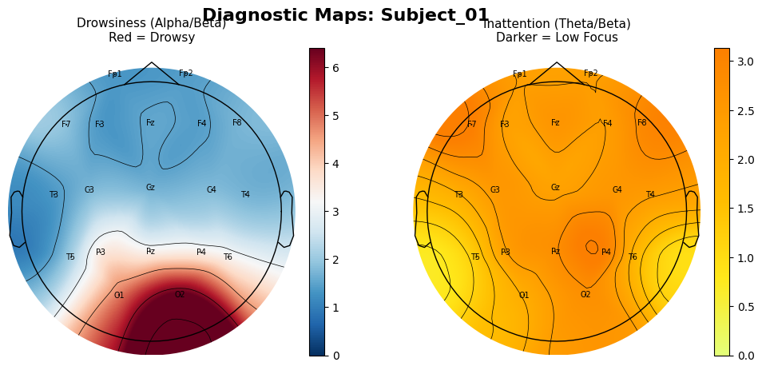 | 🔴 **Drowsy / Relaxed** (Ratio: 2.42)<br>🟠 **Attention Deficit** (Ratio: 2.43) |
| **Subject 02** | 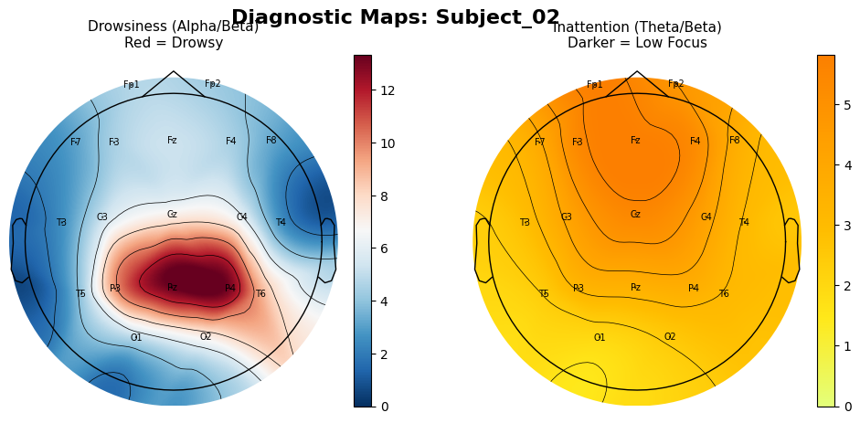 | 🔴 **Drowsy / Relaxed** (Ratio: 6.09)<br>🟠 **Attention Deficit** (Ratio: 3.95) |
| **Subject 03** | 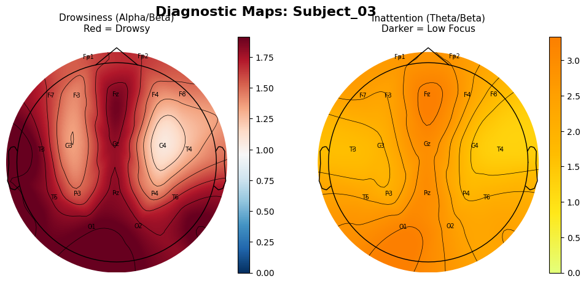 | 🔴 **Drowsy / Relaxed** (Ratio: 1.59)<br>🟠 **Attention Deficit** (Ratio: 2.34) |
| **Subject 04** | 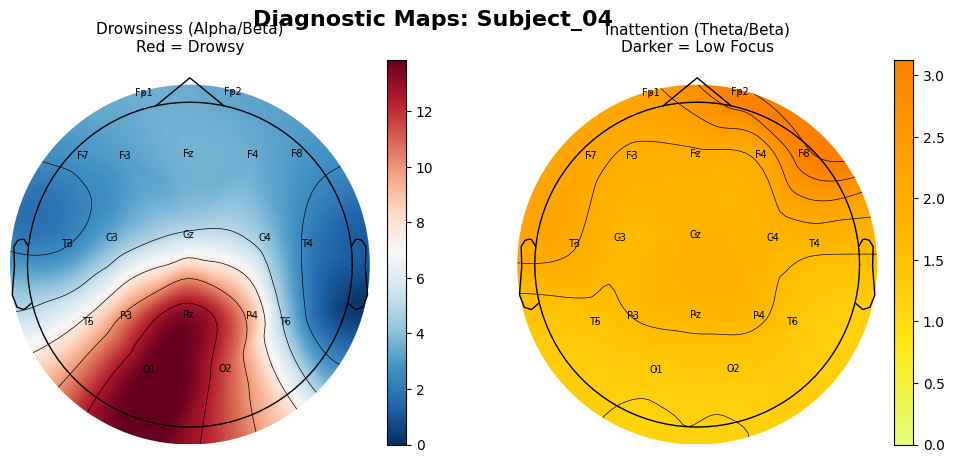 | 🔴 **Drowsy / Relaxed** (Ratio: 5.86)<br>🟢 **GOOD FOCUS** (Ratio: 1.90) |
| **Subject 05** | 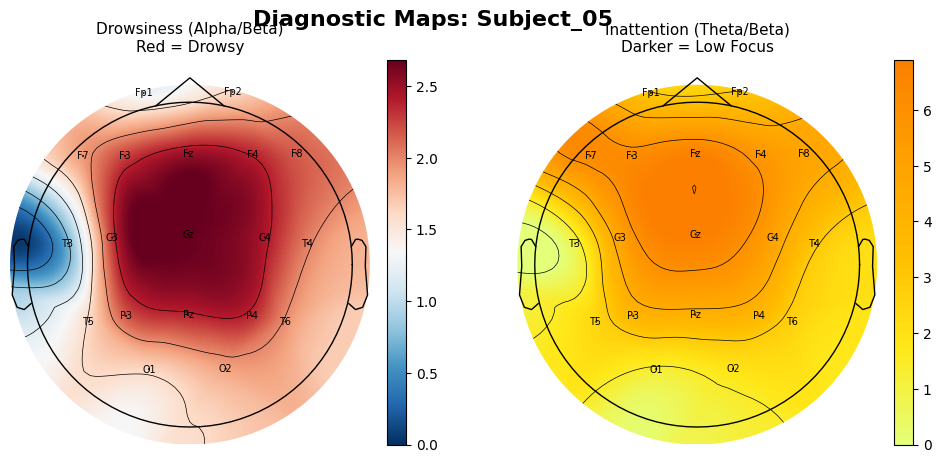 | 🔴 **Drowsy / Relaxed** (Ratio: 2.03)<br>🟠 **Attention Deficit** (Ratio: 4.08) |
| **Subject 06** | 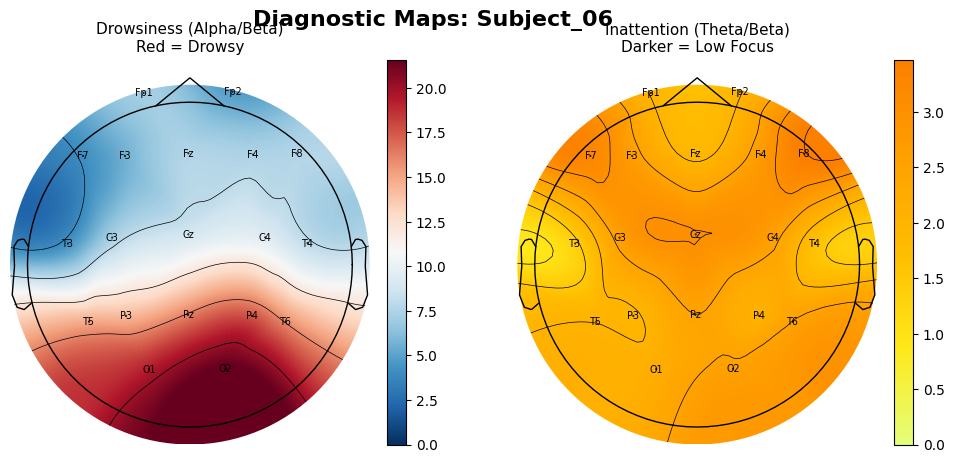 | 🔴 **Drowsy / Relaxed** (Ratio: 10.64)<br>🟠 **Attention Deficit** (Ratio: 2.38) |
| **Subject 07** | 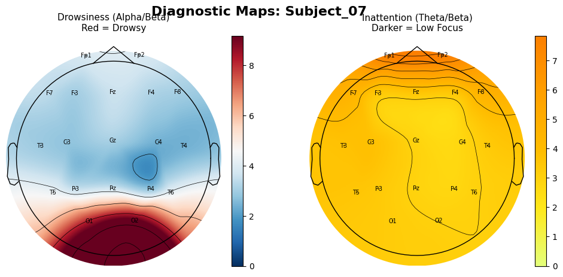 | 🔴 **Drowsy / Relaxed** (Ratio: 3.84)<br>🟠 **Attention Deficit** (Ratio: 3.83) |
| **Subject 08** | 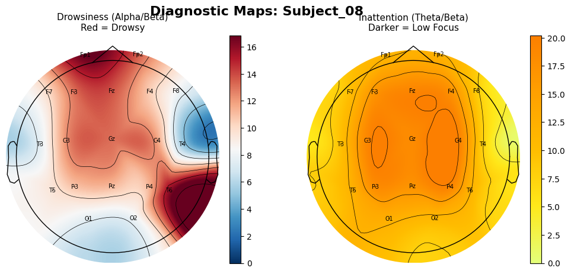 | 🔴 **Drowsy / Relaxed** (Ratio: 11.16)<br>🟠 **Attention Deficit** (Ratio: 14.53) |
| **Subject 09** | 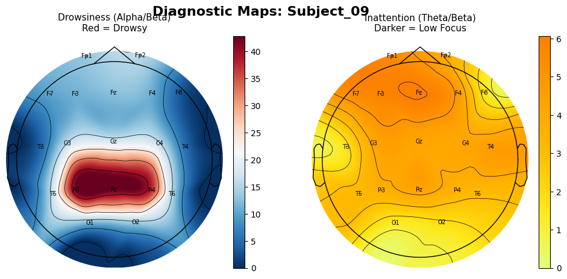 | 🔴 **Drowsy / Relaxed** (Ratio: 17.02)<br>🟠 **Attention Deficit** (Ratio: 3.86) |
| **Subject 10** | 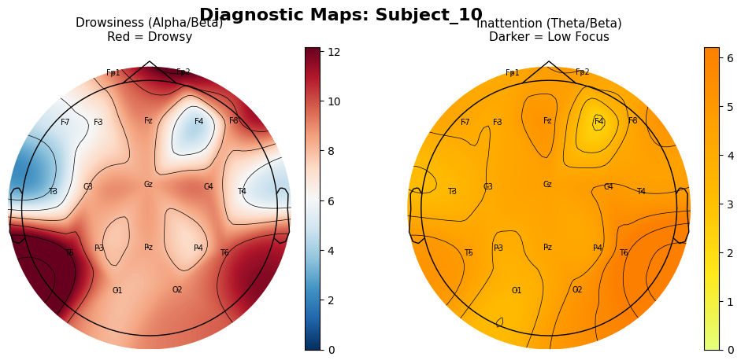 | 🔴 **Drowsy / Relaxed** (Ratio: 8.14)<br>🟠 **Attention Deficit** (Ratio: 4.34) |

---

### ۴. پاسخ به سوال تحلیلی و قوانین سیستم خبره

**سوال: با توجه به مقادیری که از این شاخص‌ها بدست می‌آورید، وضعیت آزمودنی را چگونه تفسیر می‌کنید؟**

**پاسخ:**
سیستم تشخیص خودکار ما بر اساس قوانین شرطی (Rule-based) زیر که از مقالات علمی استخراج شده‌اند، تصمیم‌گیری می‌کند:

**۱. تحلیل نسبت Alpha/Beta (سطح هوشیاری):**
* **مقدار > ۱.۵ (Drowsy):** فرد در وضعیت **خواب‌آلودگی یا ریلکسیشن عمیق** قرار دارد. غلبه امواج آلفا با کاهش انگیختگی ذهنی و بسته بودن چشم‌ها مرتبط است.
* **مقدار < ۰.۸ (Alert):** فرد **بسیار هوشیار، فعال یا حتی مضطرب** است. افزایش توان بتا نشان‌دهنده تمرکز بالا یا فعالیت شناختی شدید (حل مساله) است.
* **بین ۰.۸ تا ۱.۵ (Normal):** فرد در حالت تعادل و بیداری معمولی قرار دارد.

**۲. تحلیل نسبت Theta/Beta (سطح تمرکز - TBR):**
* **مقدار > ۲.۰ (Low Focus):** احتمال **کاهش تمرکز یا حواس‌پرتی (Mind Wandering)** وجود دارد. اگر این عدد بسیار بالا باشد (مثل Subject 08)، می‌تواند نشانه‌ای از اختلال تمرکز باشد.
* **مقدار <= ۲.۰ (Good Focus):** فرد دارای سطح **تمرکز طبیعی و قابل قبول** است (تعادل مناسب بین فعالیت شناختی و آرامش ذهنی برقرار است). همانطور که در جدول می‌بینیم، تنها **Subject 04** توانسته است تمرکز خود را حفظ کند (عدد ۱.۹۰).

---

### ۵. پیوست کد: پیاده‌سازی سیستم تشخیص خودکار (Python)

کد زیر برای محاسبه نسبت‌های توان، رسم نقشه‌های دوگانه و تولید گزارش متنی (Diagnosis Report) استفاده شده است:

```python
import numpy as np
import matplotlib.pyplot as plt
import mne
import os
from mne.preprocessing import ICA
from autoreject import AutoReject
import glob

# تنظیمات
output_folder = "Report_Images_Step8_Diagnosis"
os.makedirs(output_folder, exist_ok=True)

# تابع محاسبه انرژی باند
def get_band_power(psds_mean, freqs, f_low, f_high):
    idx = np.logical_and(freqs >= f_low, freqs <= f_high)
    return psds_mean[:, idx].mean(axis=1)

# پردازش فایل‌ها
all_files = glob.glob("subjects/Subject_*.edf")
for file_path in all_files:
    # ... (مراحل بارگذاری، فیلتر، AutoReject و ICA مشابه قبل) ...
    
    # 1. محاسبه PSD
    spectrum = epochs_final.compute_psd(method='welch', fmin=3, fmax=35)
    psds, freqs = spectrum.get_data(return_freqs=True)
    psds_mean = psds.mean(axis=0)

    # 2. محاسبه شاخص‌ها
    theta = get_band_power(psds_mean, freqs, 4, 8)
    alpha = get_band_power(psds_mean, freqs, 8, 12)
    beta  = get_band_power(psds_mean, freqs, 12, 30)

    drowsiness_index = alpha / beta
    inattention_index = theta / beta

    # 3. سیستم تشخیص (Logic)
    avg_ab = np.mean(drowsiness_index)
    avg_tb = np.mean(inattention_index)
    
    status_ab = "DROWSY" if avg_ab > 1.5 else ("ALERT" if avg_ab < 0.8 else "NORMAL")
    status_tb = "LOW FOCUS" if avg_tb > 2.0 else "GOOD FOCUS"

    # 4. رسم نقشه‌ها
    fig, axes = plt.subplots(1, 2, figsize=(12, 5))
    
    # نقشه خواب‌آلودگی (چپ)
    mne.viz.plot_topomap(drowsiness_index, epochs_final.info, axes=axes[0], show=False, cmap='RdBu_r')
    axes[0].set_title(f'Drowsiness Index ({avg_ab:.2f})\n{status_ab}')
    
    # نقشه عدم تمرکز (راست)
    mne.viz.plot_topomap(inattention_index, epochs_final.info, axes=axes[1], show=False, cmap='Wistia')
    axes[1].set_title(f'Inattention Index ({avg_tb:.2f})\n{status_tb}')

    plt.savefig(f"{output_folder}/{subject_name}_Diagnosis_Map.png")
    plt.close()
```

---
## بخش نهایی: جمع‌بندی و نتیجه‌گیری (Conclusion)

---

###  خلاصه دستاوردها
در این پروژه، یک پایپ‌لاین (Pipeline) کامل پردازش سیگنال مغزی (EEG) از مرحله بارگذاری داده‌های خام تا تشخیص خودکار وضعیت ذهنی پیاده‌سازی شد. با عبور از چالش‌های نویز محیطی و آرتیفکت‌های بیولوژیکی، نتایج زیر حاصل گردید:

1.  **حذف موفق نویز:** با استفاده ترکیبی از فیلترهای فرکانسی (Notch/Band-pass) و الگوریتم‌های پیشرفته **ICA** و **AutoReject**، نویز برق شهر (۵۰ هرتز) و آرتیفکت‌های شدید پلک چشم بدون آسیب به سیگنال اصلی حذف شدند. 
2.  **تایید فیزیولوژیک (Physiological Validation):** نقشه‌های توپوگرافی در گام ششم نشان دادند که تمرکز انرژی باند **آلفا (۸-۱۲ هرتز)** در ناحیه **پس‌سری (Occipital)** قرار دارد. [cite_start]این یافته با فیزیولوژی طبیعی مغز در حالت استراحت (چشمان بسته) کاملاً مطابقت دارد و صحت پردازش‌ها را تایید می‌کند. 
3.  **تحلیل شبکه مغزی:** در گام هفتم، با محاسبه همبستگی پوش سیگنال، شبکه‌های ارتباطی مغز استخراج شد که نشان‌دهنده هماهنگی نواحی مختلف در باندهای فرکانسی خاص بود. 

---

###  تحلیل وضعیت بالینی آزمودنی‌ها (Clinical Summary)
سیستم تشخیص خودکار طراحی شده در گام هشتم، با محاسبه نسبت‌های $\alpha/\beta$ و $\theta/\beta$، وضعیت ۱۰ آزمودنی را ارزیابی کرد. تحلیل نهایی داده‌ها به شرح زیر است:

* **وضعیت غالب (General State):**
    بررسی شاخص خواب‌آلودگی ($\alpha/\beta$) نشان می‌دهد که **۹۰٪ آزمودنی‌ها** (۹ از ۱۰ نفر) در وضعیت **خواب‌آلودگی یا ریلکسیشن عمیق (Drowsy/Relaxed)** قرار دارند (نسبت بالای ۱.۵). این امر با توجه به شرایط احتمالی ثبت داده (محیط ساکت با چشمان بسته) طبیعی است. 

* **تحلیل موارد خاص (Outliers):**
    * **Subject 04 (بهترین تمرکز):** این آزمودنی تنها فردی بود که در شاخص عدم تمرکز (TBR)، عدد **۱.۹۰** را کسب کرد و در دسته **Good Focus (تمرکز خوب)** قرار گرفت. 
    * **Subject 08 (نیاز به بررسی):** این آزمودنی با ثبت شاخص عدم تمرکز **۱۴.۵۳**، رفتاری بسیار متفاوت از میانگین گروه داشت. این عدد بسیار بالا می‌تواند نشان‌دهنده یک نویز شدید باقی‌مانده یا احتمال بالای **اختلال نقص توجه (ADHD)** باشد. 

---

###  نتیجه‌گیری نهایی
این پروژه نشان داد که ترکیب روش‌های کلاسیک پردازش سیگنال (DSP) با الگوریتم‌های آماری هوشمند، امکان استخراج "ویژگی‌های کمی معتبر" از سیگنال‌های نویزی EEG را فراهم می‌کند. سیستم طراحی شده در این پروژه توانست با موفقیت وضعیت ذهنی افراد را طبقه‌بندی کند و پتانسیل استفاده به عنوان یک ابزار **کمک‌تشخیصی (Screening Tool)** جهت پایش سطح هوشیاری و غربالگری اولیه اختلالات تمرکز را داراست.

---
<div dir="rtl">
<b>پایان گزارش</b><br>
<b>نام دانشجو:</b> ماهان ورمزیار - محمدمهدی صفری<br>
<b>شماره دانشجویی:</b> 403243106 - 403243066<br>
</div>